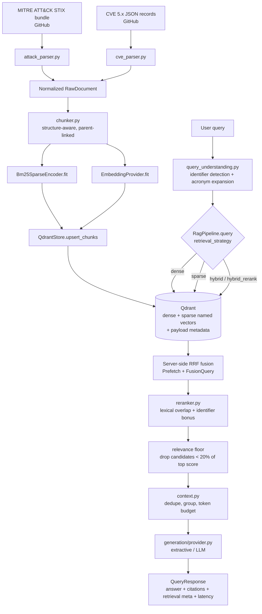
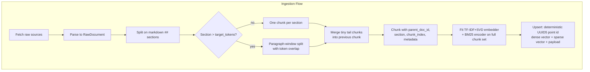
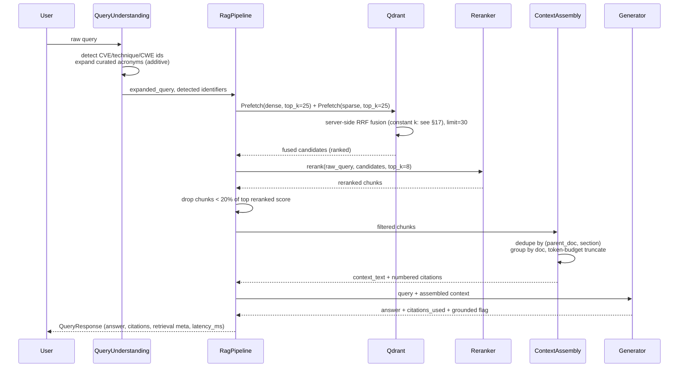
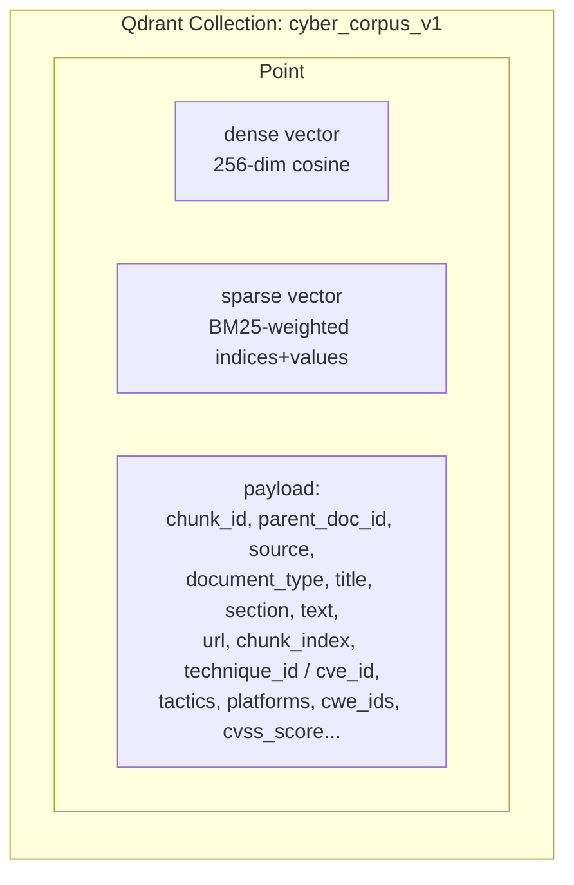
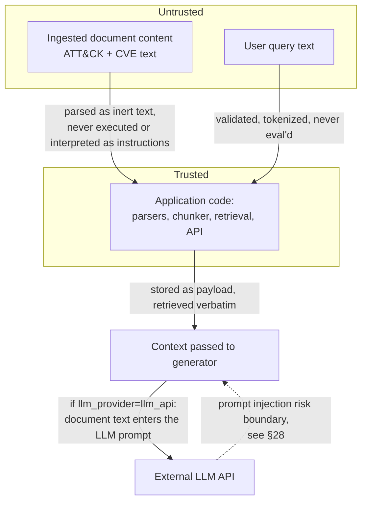

# ARCHITECTURE.md — Hybrid RAG Over a Niche Cybersecurity Corpus

Status: describes a system that has been **built and validated**, not a proposal. Every
schema, default, and metric below is taken directly from working code in this repository
and from experiment runs against real data (697 MITRE ATT&CK techniques, 20 real CVE
records). Where a component is a deliberate stand-in rather than the target production
choice, that is stated explicitly rather than glossed over — see §2 and §42.

**Scope of the evidence.** The evaluation in §23 is a 10-query *development benchmark*
run on the local stand-in stack (§42, Tier A). It supports descriptive observations about
this corpus and this stack; it does not establish that any retrieval strategy is
superior in general, and it does not say anything about transformer embeddings, a
cross-encoder, or an LLM, none of which have been run. §23–§24 define the query taxonomy,
experiment matrix, and evaluation-set growth plan intended to answer the research
question properly.

---

## 1. Executive Summary

This system indexes a cybersecurity corpus (MITRE ATT&CK technique descriptions + CVE
vulnerability records) in Qdrant using **two named vectors per chunk** — dense (semantic)
and sparse (BM25 lexical) — and answers questions through a pipeline of query
understanding → parallel dense+sparse retrieval → server-side Reciprocal Rank Fusion →
reranking → relevance-floor filtering → context assembly → grounded generation.

The corpus was chosen because it mixes two kinds of retrieval signal that behave
differently: **exact identifiers** (`CVE-2021-44228`, `T1003.001`, `CWE-79`) that are
lexically distinct but textually near-identical to sibling identifiers, and
**conceptual/behavioural descriptions** where the query may share little vocabulary with
the relevant document. That makes it a useful testbed for this research question:

> **RQ.** For which classes of cybersecurity query does dense, sparse, or hybrid
> retrieval perform best — and how much do reranking, query understanding, and metadata
> filtering change that answer?

The system is not built on the premise that hybrid retrieval is the best strategy. On the
current 10-query development benchmark (§23), sparse-only retrieval is at or above hybrid
on Recall@5 (0.875 vs 0.850), MRR (0.733 vs 0.717) and nDCG@5 (0.757 vs 0.727); hybrid
leads only on precision@5 and citation_correctness, by small margins. Hybrid is above
dense-only on MRR (0.717 vs 0.600). Every one of these differences is small enough to be
produced by one or two queries changing rank, so none is treated as a finding (§23.1).
One per-query illustration — a bare `CVE-2021-44228` query where LSA dense retrieval
ranks the correct CVE third and BM25 ranks it first — shows *why* lexical retrieval can
matter for identifiers under the current embedder; it is an illustration, not a measured
rate.

Two configuration tiers are kept distinct throughout: the **local stand-in stack** that
produced every number in this document, and the **intended transformer-embedding +
cross-encoder + LLM stack**, which has been written but never executed (§42).

Everything in the pipeline — chunk size, retrieval depth per stage, fusion constant,
reranker choice, embedding model, LLM provider — is a typed config field
(`src/config.py`), not a hard-coded constant, so every claim in this document about "what
happens if you change X" can be tested by changing one field and re-running
`experiments/run_experiments.py`.

## 2. Existing Repository Analysis

There was no pre-existing repository. The original handoff brief instructed inspecting an
existing codebase before designing; that step was performed and found no prior code,
README, dependency file, or infrastructure to inspect, evolve, or preserve. This
document therefore describes a from-scratch build, not an evolution of prior work. That
distinction matters for §37 (Alternatives Considered) and §40 (Implementation Phases):
there was no legacy technology commitment constraining any decision below.

## 3. Goals

- Demonstrate genuine understanding of hybrid information retrieval (dense, sparse,
  fusion, reranking) over a domain where lexical identifiers and semantic concepts behave
  differently — not a generic "upload PDF, ask LLM" chatbot.
- Characterize, per query class, when dense, sparse, and hybrid retrieval each perform
  best (§23.2–§23.3), rather than assuming one strategy is best in general.
- Make every stage of the pipeline independently swappable and measurable: a different
  embedding model, reranker, or LLM should be a one-line config change, not a rewrite.
- Ground every generated answer in numbered citations traceable to a specific retrieved
  chunk and its source document; never silently invent a source.
- Provide a real, reproducible evaluation and experiment framework comparing retrieval
  strategies quantitatively, not just "it seems to work when I try it."
- Run entirely locally with zero external service dependency for the vector store
  (embedded Qdrant, no Docker required for development).

## 4. Non-Goals (for this version)

- Not a production-scale system: 717 source documents / 1,162 chunks is a demonstration
  corpus, not a claim about behavior at millions of chunks (see §34, Scalability).
- Not a fully general cybersecurity knowledge base — NIST SP 800-series, CISA advisories,
  OWASP docs, and the full CVE/NVD feed are explicitly out of scope for v1 (see §5) and
  flagged as a Phase 1 follow-on, not silently promised.
- Not a multi-tenant or authenticated system. No auth layer exists yet (see §28).
- Not a validated claim about which retrieval strategy is best: current results are a
  10-query development benchmark on the local stack (§23.1).
- Not claiming the local embedding/reranking/generation stand-ins (§42) are equivalent in
  quality to their transformer/LLM counterparts — they are honestly weaker, documented,
  swappable placeholders forced by this environment's network sandbox, not a design
  preference.

## 5. Current Architecture

There is no prior architecture to describe (see §2). This section is intentionally empty
beyond that statement, per the "don't reproduce a section that doesn't apply" instinct
this document tries to model throughout.

## 6. Proposed Architecture



The pipeline follows the ingestion → normalization → chunking → indexing → query
understanding → retrieval → fusion → reranking → context → generation → response shape
from the original handoff brief, with two changes made after building it:

1. **A relevance-floor stage was inserted between reranking and context assembly**
   (`Config.rerank_relative_score_floor`). This was not in the original plan; it was added
   mid-build after observing the extractive generator produce noisy answers when the fused
   candidate set contained a few strong matches and several weak ones that only survived
   because `top_k_fused` had to be large enough for genuinely hard queries. See §23 for the
   measured change (citation_correctness 0.260 → 0.418, about 1.6x, on `hybrid_rerank`
   vs `hybrid`). The floor's own contribution has **not** been isolated by ablation, and
   its 20% threshold was chosen after observing this same 10-query set (§23.1, §24 E3).
2. **Citation grounding validation happens inside generation, not as a separate
   post-hoc stage** (`GenerationResult.grounded`), because `ExtractiveLocalProvider`
   composes answers directly out of cited spans — grounding is true by construction, not
   verified after the fact. This changes for `AnthropicProvider` (§21), where the model
   can in principle claim something the context doesn't support; a proper claim-level
   faithfulness checker is listed as a Phase 7 extension (§41), not yet built.

## 7. Architecture Diagram

See §6 (system) and below (ingestion, query, data model, trust boundaries).









## 8. Component Breakdown

| Component | File | Status |
|---|---|---|
| ATT&CK parser | `src/ingestion/attack_parser.py` | Built, tested |
| CVE parser | `src/ingestion/cve_parser.py` | Built, tested (known CVSS gap, §11; affects metadata-filter evaluation, §24 E7) |
| Chunker | `src/ingestion/chunker.py` | Built, tested |
| Ingestion orchestrator | `src/ingestion/pipeline.py` | Built, working |
| Embedding providers | `src/retrieval/embeddings.py` | Local provider built; transformer provider written, never executed (§42) |
| Sparse encoder | `src/retrieval/sparse.py` | Built, tested |
| Qdrant store | `src/retrieval/qdrant_store.py` | Built, working (schema, upsert, dense/sparse/hybrid search) |
| Query understanding | `src/retrieval/query_understanding.py` | Built, tested |
| Reranker | `src/retrieval/reranker.py` | Local reranker built; cross-encoder written, never executed (§42) |
| Context assembly | `src/retrieval/context.py` | Built, working |
| Generation providers | `src/generation/provider.py` | Extractive built; Anthropic/local-LLM written, never exercised (§42) |
| RAG pipeline orchestrator | `src/rag_pipeline.py` | Built, working |
| Eval metrics | `src/eval/metrics.py` | Built, tested |
| Experiment runner | `experiments/run_experiments.py` | Built, produces §23's numbers |
| API | `src/api/main.py` | Built, manually verified with live requests |
| CLI | `scripts/ingest.py`, `scripts/query.py` | Built, working |
| Frontend | — | **Not started** (§26, §40) |
| Auth/rate limiting | — | **Not started** (§28, §40) |
| Structured logging/tracing | — | **Not started** (§27, §40) |

## 9. Data Flow

Raw sources → `RawDocument` (normalized, markdown-structured text + typed metadata) →
`Chunk` (parent-linked, section-aware) → fitted embedding/sparse models → Qdrant point
(dense vector + sparse vector + payload) → at query time: query text → `QueryAnalysis`
(expanded query + detected identifiers) → `RetrievedChunk` list (from dense, sparse, or
server-side RRF-fused search) → reranked + floor-filtered `RetrievedChunk` list →
`AssembledContext` (deduped, grouped, budget-truncated, numbered) → `GenerationResult`
(answer + citations used + grounded flag) → `QueryResponse` (API/CLI output shape).

## 10. Ingestion Pipeline

`src/ingestion/pipeline.py::run_ingestion()`, six stages, ~6 seconds end-to-end for the
current corpus size:

1. Parse ATT&CK STIX bundle → 697 `attack-pattern` objects (techniques + sub-techniques),
   revoked/deprecated objects filtered out, citation footnotes stripped from description
   text.
2. Parse CVE JSON records → 20 published CVEs, defensively handling schema variance across
   CNAs (see §11).
3. Chunk every document (see §12).
4. Fit `EmbeddingProvider` on the full chunk text set.
5. Fit `Bm25SparseEncoder` on the same set.
6. Upsert all chunks into Qdrant with deterministic point IDs (UUID5 of `chunk_id`), so
   re-running ingestion on an unchanged corpus is idempotent — it overwrites identical
   points rather than duplicating them.

Fitted models are persisted (`data/processed/embedder.pkl`, `sparse.pkl`) so
`scripts/query.py` and the API don't need to re-fit on every process start
(`ingestion/pipeline.py::load_store()`).

## 11. Document Processing

**ATT&CK**: `_external_id()`/`_external_url()` pull the canonical `T####[.###]` id and
attack.mitre.org URL from `external_references`; tactics are resolved from
`kill_chain_phases` against a `x-mitre-tactic` shortname lookup built once per parse run,
not looked up per-technique. Citation markers like `(Citation: Foo)` are stripped from
description/detection text — they're STIX bibliography artifacts, not useful retrieval
signal.

**CVE**: every field access is defensive on purpose. Real CVE records are inconsistent —
CVSS metrics arrive in different shapes per CNA (`cvssV3_1`, `cvssV3_0`, or a bare
qualitative `"other"` severity string), and `problemTypes`/CWE ids are sometimes absent
entirely. `_extract_cvss()` tries versions newest-to-oldest before falling back to
qualitative severity; a document with none of these still gets indexed with degraded
metadata rather than being dropped. **Known gap**: `_extract_cvss()` only reads the CNA
container; several of the 20 seeded CVEs (older ones) show `cvss_score: None` because
their CVSS actually lives in the NVD "ADP" (Authorized Data Publisher) container, which
isn't read yet. Documented here rather than silently wrong — real fix is reading
`containers.adp[].metrics` as an additional fallback.

## 12. Chunking Strategy

`src/ingestion/chunker.py`. Not naive fixed-token chunking. Each normalized document is
already lightly structured as markdown (`# Title`, `## Section`) by the parsers, so
chunking splits on those `##` boundaries first (`_split_sections`), and only falls back to
a paragraph-window split (`_window_split`, target 220 tokens, 40-token overlap by default)
when a single section still exceeds the target size. A tail piece smaller than
`chunk_min_tokens` (40) gets merged into the previous chunk rather than indexed as a
near-empty, low-signal fragment.

Every chunk carries `parent_doc_id`, `section`, and `chunk_index`, giving a
`Document → Section → Chunk` hierarchy without a separate table: `context.py` groups
retrieved chunks back by `parent_doc_id` at generation time, and `api/main.py`'s
`/documents/{id}` endpoint reconstructs a full document by scrolling all chunks sharing a
`parent_doc_id`.

Token counting uses a cheap word-count approximation (`_approx_tokens`, ~1.3 tokens/word),
not a real tokenizer — adequate for chunk-sizing decisions, not for exact LLM context-
window accounting; swapping in `tiktoken` is a small, isolated change if exact budgets
start to matter (e.g. once a real LLM provider with a hard context limit is wired in).

Result on this corpus: 717 documents → 1,162 chunks.

## 13. Metadata Model

Per-point Qdrant payload (see §14 for the full field list). Two metadata families:

- **Universal**: `chunk_id`, `parent_doc_id`, `source` (`mitre_attack` | `cve_nvd`),
  `document_type` (`attack-technique` | `vulnerability`), `title`, `section`, `text`,
  `url`, `chunk_index`.
- **Source-specific**: ATT&CK chunks additionally carry `technique_id`, `is_subtechnique`,
  `tactics`, `platforms`, `data_sources`; CVE chunks carry `cve_id`, `cwe_ids`,
  `cvss_score`, `cvss_severity`, `affected_products`, `published`.

Only fields with a non-empty value are written to the payload (`if v not in (None, [], "")`
in `qdrant_store.py::upsert_chunks`), so a CVE with no resolved CWE doesn't carry a
misleading empty list into every filter query.

## 14. Qdrant Collection Design

**One collection (`cyber_corpus_v1`), not two.** Decision and rationale: queries routinely
need to cross document types — "which techniques are associated with deserialization-style
CVEs?" touches both corpora at once. A single collection lets that be one query with a
payload filter; two collections would mean fanning out to both and merging results
client-side, which duplicates the fusion logic Qdrant already does natively for
dense+sparse. The tradeoff is that filtering by `document_type`/`source` becomes load-
bearing for type-scoped queries rather than being implicit in which collection you asked —
addressed by indexing those fields (see below).

**Two named vectors per point** (`dense`, `sparse`), not two collections and not a single
concatenated vector. A named-vector point keeps a chunk's dense and sparse representations
upsert-atomic — there is no code path where one gets updated and the other doesn't, since
`upsert_chunks` writes both in the same `PointStruct`.

**Payload indexes** are created for `source`, `document_type`, `technique_id`, `cve_id`,
`cwe_ids`, `tactics`, `platforms`, `parent_doc_id` (`qdrant_store.py::create_collection`).
These are no-ops in Qdrant's embedded local mode (it emits a warning to that effect) but
take effect immediately if this collection is ever pointed at a real Qdrant server —
written now so that migration requires no schema change, only a connection-string change.

**Point IDs**: `uuid5(NAMESPACE_URL, chunk_id)` — deterministic, so re-ingesting an
unchanged document upserts the same point rather than duplicating it. **Known limitation**:
this makes ingestion idempotent for unchanged documents but not incremental for changed
ones in a fully principled way — a changed document's old chunks (if re-chunking produces
fewer chunks than before) would be silently orphaned rather than deleted. A real
`document version` / `content_hash` field and an explicit "delete stale chunks for this
parent_doc_id before upserting new ones" step is the correct fix, not yet built (§32,
§41).

**Deletion, re-indexing, embedding versioning**: not implemented. `DELETE
/api/v1/documents/{id}` and `POST /api/v1/reindex` are specified in §25 but intentionally
not wired to HTTP yet (see that section for why).

## 15. Dense Retrieval

`src/retrieval/embeddings.py`, `QdrantStore.search_dense`. Behind an `EmbeddingProvider`
interface so the concrete model is swappable without touching retrieval, fusion, or
anything downstream.

**What ships and runs today**: `TfidfSvdEmbeddingProvider` — TF-IDF (unigrams+bigrams,
sublinear TF, up to 50k features) followed by truncated SVD to 256 dimensions (classic
LSA/LSI). This is a forced substitution, not a preference: this environment's network
allowlist has no route to `huggingface.co`, so no transformer model weights can be
downloaded. LSA is a real, textbook dense-retrieval technique — corpus-level co-occurrence
captures some synonymy — but it has no general language understanding beyond this
corpus's vocabulary, unlike a pretrained bi-encoder.

**Consequence for interpreting results**: this "dense" arm is derived from the same
n-gram/identifier vocabulary the sparse arm indexes (TF-IDF features feed the SVD), so
today's dense-vs-sparse comparison is **LSA vs BM25**, not "semantic embedding vs lexical
matching" in the sense the research question intends. Conclusions about dense retrieval
require a transformer embedder (§42, E5).

**Documented swap-in**: `SentenceTransformerEmbeddingProvider`, already written in the same
file, wired to `BAAI/bge-small-en-v1.5` by default. Activating it is
`embedding_provider = "sentence_transformers"` in `Config` plus `pip install
sentence-transformers`. Consumers only depend on the `EmbeddingProvider.embed() ->
np.ndarray` contract, but the swap is **not** a pure config change and has never been
executed in the build environment (no weight download was possible), so its correctness is
unverified. Known required work: (a) the collection's dense vector size is 256 (§7, §14) and
`bge-small-en-v1.5` produces 384-d vectors, so a new collection must be created and the
corpus re-ingested; (b) BGE models are documented to work best when short queries carry a
retrieval instruction prefix, which the provider must apply on the query side only;
(c) fusion and floor parameters tuned on the LSA embedder must be re-tuned (§24 E2, E5).

## 16. Sparse Retrieval

`src/retrieval/sparse.py`, `QdrantStore.search_sparse`. This is why sparse retrieval is
first-class rather than incidental in this architecture: `CVE-2021-44228` and
`CVE-2021-44832` are both Log4j CVEs with very similar surrounding prose — a dense
embedding routinely ranks them close together. BM25 treats them as different tokens
entirely and ranks the exact match highest. §23 shows one query where this happens under
the LSA embedder; that is an illustration, not a measured rate, and it may not hold for a
transformer embedder.

Implementation is classic BM25 term weighting (Robertson/Sparck-Jones, k1=1.5, b=0.75),
encoded as **Qdrant native sparse vectors** (`models.SparseVector(indices, values)`) so
BM25-equivalent scoring happens inside Qdrant itself, not in a separate Python-side index —
this is what makes server-side hybrid fusion possible (§17) instead of requiring
client-side score merging.

**Tokenization is identifier-safe by design**: `_TOKEN_RE =
r"[A-Za-z0-9]+(?:[-.][A-Za-z0-9]+)*"` keeps `CVE-2021-44228`, `T1003.001`, and `CWE-79`
intact as single tokens. Sklearn's default word tokenizer would split `CVE-2021-44228`
into `["CVE", "2021", "44228"]`, destroying the exact-match signal the whole sparse stage
exists to provide — verified by `tests/test_pipeline_components.py::test_tokenize_preserves_identifiers`.

**Side effects of identifier-safe tokenization (hypotheses, not yet measured)**: because
`T1003.001` is one token, a query for the parent `T1003` produces a different token and
will not lexically match sub-technique chunks unless the plain string `T1003` appears in
their text; and hyphen/dot-joined ordinary words are kept as single tokens, so they do not
match their component words. Both are testable with the identifier-family sub-type of the
exact-identifier class (§23.3).

Document-side vectors use full BM25 weighting (term saturation × IDF); query-side vectors
use plain IDF per unique query term, so their dot product reproduces the standard BM25
score formula.

## 17. Hybrid Fusion

`QdrantStore.search_hybrid_rrf`. Dense and sparse candidate sets (`top_k_dense=25`,
`top_k_sparse=25` by default) are fetched via `models.Prefetch` and fused **inside Qdrant
itself** using `models.FusionQuery(fusion=models.Fusion.RRF)` — confirmed working even in
Qdrant's embedded/local mode (`qdrant-client` 1.19.1; this was not obvious going in and is
worth re-checking on client upgrades), truncated to `top_k_fused=30`.

**Why RRF and not raw score fusion**: dense scores (cosine similarity, roughly `[0,1]`) and
sparse scores (unbounded BM25 weight) live on incomparable, uncalibrated scales — naively
summing or averaging them lets whichever score happens to have larger typical magnitude
dominate, and that magnitude isn't stable across queries. RRF fuses **ranks**, not scores
(`score = Σ 1/(k + rank)` per retriever; the constant `k` is discussed below), which is scale-free, robust to
score-distribution outliers, and needs no per-query-type normalization or calibration.
The tradeoff is that RRF discards score *magnitude* information — a dense hit at rank 1
with cosine 0.95 counts the same as one with cosine 0.55 — which is an acceptable loss
given the alternative (uncalibrated raw-score fusion) is worse for this corpus's
mixed-scale-score problem.

**Effective RRF constant — must be verified before any fusion conclusion.** Earlier
revisions of this document stated `k=60`. Qdrant's documented default for its RRF fusion is
`k=2` (the original RRF paper uses 60), applied unless a query passes an explicit RRF
parameter object (`RrfQuery(rrf=Rrf(k=...))` in current clients); the local-mode
client fusion code uses the same default. The call described above uses
`FusionQuery(fusion=Fusion.RRF)`, which does not carry `k`, so the effective constant is
most likely 2 and `Config.rrf_k` may not be reaching Qdrant at all. Consequences: (a) the
`k=60` previously shown in the sequence diagram and text, and any planned "`rrf_k` sweep" are unreliable until this is
checked (grep `qdrant_store.py` for how `rrf_k` is used); (b) with k=2 the head of each
list is weighted steeply (rank 1 carries about 5.5x the weight of rank 10, versus about
1.15x at the paper's k=60), which favours whichever list places a document first and
changes how much a strong sparse rank-1 hit can be diluted by a weak dense list — a
candidate explanation, untested, for hybrid not beating sparse in §23.

Alternatives available natively in Qdrant and not yet run: RRF with explicit `k` and
per-prefetch weights (if the installed client exposes them — check the version), and
distribution-based score fusion (DBSF). Client-side weighted fusion over the two prefetch
result lists is the fallback. A rule-based router (identifier detected → sparse-only) is a
further baseline worth running because it needs no fusion at all. See §24 E2.

## 18. Reranking

`src/retrieval/reranker.py`, `Reranker` interface. Runs on the fused candidate set
(`top_k_fused=30` by default) and re-scores it with a model that reads query and chunk
together, then truncates to `top_k_rerank=8`.

**Candidate-count tradeoff, addressed explicitly rather than left as an arbitrary
constant**: `top_k_fused` too small caps the reranker's recall ceiling — it can only
promote a chunk that survived fusion in the first place. Too large and reranking cost
scales roughly linearly with candidate count (a cross-encoder is 10-100x slower per item
than the retrieval that produced the candidates). `top_k_rerank` too small starves
generation of grounding evidence on multi-fact queries; too large dilutes context budget
on marginally relevant chunks. The defaults (30 / 8) are config fields, not hard-coded, and
`experiments/run_experiments.py` is the intended tool for sweeping them — not yet swept in
this session, flagged as a Phase 7 follow-on (§41).

**What ships and runs today**: `LexicalOverlapReranker` — query/chunk token-overlap
(Jaccard-style) plus a bonus for shared alphanumeric identifiers. This is explicitly *not*
presented as equivalent to a cross-encoder; it reuses lexical signal the sparse retriever
already had. On the 10-query benchmark, `hybrid_rerank` (lexical reranker **plus** the
relevance floor) scored *lower* than plain `hybrid` on Recall@5 (0.825 vs 0.850), MRR
(0.650 vs 0.717) and nDCG@5 (0.652 vs 0.727), and higher on precision@5 and
citation_correctness (0.425 vs 0.260; 0.418 vs 0.260, about 1.6x). So the measured
ranking-quality effect of this reranker configuration is neutral-to-negative. The
precision gain coincides with the floor truncating the list, but no ablation separates
reranker from floor, and if precision is computed over a list shorter than k it is
inflated mechanically (§23.1, §24 E3). A lexical reranker on top of a lexical retriever
would also be expected to help identifier queries and hurt paraphrase queries — a
hypothesis the per-class evaluation can test.

**Documented swap-in**: `CrossEncoderReranker`, wired to
`cross-encoder/ms-marco-MiniLM-L-6-v2` by default, already written in the same file.
Activating it is `reranker = "cross_encoder"` plus `pip install sentence-transformers`.
This code has never been executed in the build environment. The relevance floor (drop
candidates below 20% of the top score) assumes non-negative, comparable scores; MS MARCO
cross-encoder checkpoints typically emit unbounded scores that can be negative depending
on the activation the loaded config applies, so the floor must be redefined (for example on
a normalized score, or replaced by a fixed top-k or an absolute threshold) and re-tuned
on the dev split before it is used with this reranker. MS MARCO is a web-search
training distribution; its transfer to ATT&CK/CVE prose is an empirical question (§24 E6).

## 19. Query Understanding

`src/retrieval/query_understanding.py`. Deliberately narrow, per the original brief's
explicit warning against over-engineering this stage:

1. **Identifier detection** (`CVE_RE`, `TECHNIQUE_RE`, `CWE_RE`): regex-detects CVE /
   ATT&CK technique / CWE ids in the raw query. Currently surfaced in `retrieval_meta` for
   observability (§17 of the original brief; here §27) and available for the API layer to
   use as filter candidates; not yet wired into automatic filter application (a query
   containing `CVE-2021-44228` doesn't currently auto-filter to `source=cve_nvd` — it
   relies on the sparse retriever's exact-token match instead, which §23 shows works, but
   an explicit filter would be a stronger guarantee and is a natural small follow-on).
2. **Acronym expansion**: a small, curated glossary (`ACRONYM_GLOSSARY`, ~10 entries: `C2`
   → command and control, `RCE` → remote code execution, `credential dumping` → LSASS/SAM/
   NTDS, etc.), not a general NLP expansion step. Expansion is strictly **additive** — the
   expanded query is `f"{query} ({expansions})"`, original terms always retained — so a
   precise query that happens to contain a glossary substring never has its exact terms
   diluted or replaced, only supplemented. Verified by
   `test_query_understanding_expands_known_acronyms_only`, which also checks a query with
   no glossary match passes through completely unexpanded.

**Evaluation caveats for this stage**: `credential dumping → LSASS/SAM/NTDS` is a
phrase expansion, not an acronym; the glossary should be evaluated separately for
in-glossary and out-of-glossary abbreviations, and it must be frozen before the
evaluation set grows, because a glossary written while looking at the eval queries
produces in-sample gains (§23.4, §24 E4).

## 20. Context Construction

`src/retrieval/context.py::assemble_context`. Three problems with naive
"concatenate the top-K chunks" addressed explicitly:

1. **Near-duplicate chunks** (overlapping windows of the same section) waste context
   budget without adding information → deduplicated by `(parent_doc_id, section)`, keeping
   whichever instance scored higher.
2. **Reading order**: pure relevance-score order interleaves unrelated documents
   incoherently → deduped chunks are grouped by source document (group order = each
   group's best score), and ordered by `chunk_index` within a group, so a reader (or an
   LLM) encounters a document's content in its original order, not shuffled by score.
3. **No token budget** → chunks are added, in that grouped order, until
   `max_context_tokens` (1,800 by default) is hit. A chunk that would exceed the remaining
   budget is dropped whole (`dropped_for_budget` counter), never mid-sentence truncated —
   a half-sentence chunk is worse than one fewer whole chunk.

Neighboring-chunk inclusion (pulling in a chunk's unretrieved siblings for extra context)
is not implemented — `parent_doc_id` + `chunk_index` make it straightforward to add
(scroll siblings the way `/api/v1/documents/{id}` already does) but it wasn't needed to get
citation-correctness gains in this session; flagged as a Phase 6 candidate if evaluation
shows the generator needs more surrounding context than single chunks provide.

## 21. LLM Generation

`src/generation/provider.py`, `LLMProvider` interface — the app is not coupled to one
model vendor; `RagPipeline` only calls `LLMProvider.generate(query, context) ->
GenerationResult`.

**What ships and runs today**: `ExtractiveLocalProvider`. No API key, no downloadable
model weights required — this sandbox has neither an `ANTHROPIC_API_KEY` configured by
default nor egress to a model-weight host. It scores every sentence in every cited chunk
by query-token overlap, keeps the top N (6 by default), and joins them with their citation
markers restored to source order. This is an honestly-labeled substitute, not presented as
fluent-LLM-equivalent: what it preserves is the property this architecture cares about
most — every sentence in the answer *is* a citation's text, verbatim, so grounding is true
by construction rather than needing separate verification.

**Documented swap-ins** (written in the same file, never executed in the build environment, §42):
- `AnthropicProvider` (`llm_provider = "llm_api"`, needs `ANTHROPIC_API_KEY`): prompts
  the model to answer only from the numbered context and cite every claim with its `[N]`
  marker; parses `[N]` markers back out of the response to populate `citations_used`.
  It is expected to be the largest single improvement in answer fluency (not yet measured),
  and needs claim-level faithfulness evaluation (§23.5) and injection hardening (§28)
  before it is trusted.
- `LocalLlamaProvider` (`llm_provider = "llm_local"`): stubbed, raises
  `NotImplementedError` — wiring it up needs a reachable local inference server
  (Ollama/llama.cpp), which this sandbox also can't set up (no route to a model registry).

## 22. Citation Architecture

Every chunk that reaches the generator gets a stable integer marker (`Citation.marker`,
assigned in `context.py` in the order chunks are added to the context). `GenerationResult`
carries `citations_used: list[int]` — for `ExtractiveLocalProvider` this is exactly the set
of markers whose sentences were selected; for `AnthropicProvider` it's parsed from `[N]`
markers the model actually emitted in its answer text. `RagPipeline.query` filters the full
citation list down to only `citations_used` before returning it to the caller, so the API
response's `citations` field never lists a source the answer text doesn't actually
reference.

Response shape (matches the original brief's suggested structure, §14, minus a fabricated
confidence score — see below):

```json
{
  "answer": "...",
  "citations": [{"marker": 1, "chunk_id": "...", "title": "...", "section": "...", "url": "...", "source": "..."}],
  "retrieval": {"strategy": "hybrid_rerank", "candidates": 30, "reranked": 8, "above_relevance_floor": 3, "detected_cves": [], "expansion_terms": []},
  "latency_ms": {"retrieval_ms": 0, "reranking_ms": 0, "generation_ms": 0, "total_ms": 0},
  "grounded": true
}
```

No `confidence` field is emitted. Per the original brief's explicit instruction: if
confidence can't be reliably calibrated, report retrieval evidence instead of a fake
number. `grounded: false` plus an empty `citations` list (emitted when no candidates clear
retrieval — see §29, "no relevant documents" handling) is the honest substitute.

## 23. Evaluation Framework

**Status: development benchmark, not a validated evaluation.** Everything in this section
was measured on the Tier A local stack (§42) against 10 queries. Read the results as a
working smoke test that motivates the taxonomy and experiment plan in §23.2–§24, not as
evidence about retrieval strategies in general.

`eval_data/eval_set.json` — 10 hand-labeled queries, each with `expected_doc_ids`
(document-level, not chunk-level — a query is satisfied whether it retrieves chunk 0 or
chunk 2 of the right document, and document-level labeling was far cheaper to produce
correctly at this corpus size than chunk-level would have been) and free-text `notes`
explaining *why* that query was chosen (exact-identifier lookup, colloquial-name-to-ID
mapping, acronym-expansion test, older-CVE parser-robustness test, etc.). The set was
written by the system's author to stress the specific failure modes the architecture
targets. Two consequences: it is biased toward cases where the design is expected to work,
and components added while looking at it (the relevance floor, §6; the acronym glossary,
§19) are **in-sample** on it. It is retained as a development benchmark (`dev10`) for
regression and debugging.

`src/eval/metrics.py` computes, all document-level: **Recall@K, Precision@K, MRR,
nDCG@K, Hit Rate**, plus `citation_correctness` (fraction of the answer's actual citations
that point to an expected document — a cheap proxy for citation faithfulness, not
claim-level LLM-judged faithfulness, which is listed as a Phase 7 extension, §41). Note
that for the extractive generator, `citation_correctness` tracks precision@k closely in
the results below (0.253/0.253, 0.232/0.238, 0.260/0.260 for dense, sparse, hybrid),
which is what one would expect if it mostly measures the precision of the context set
rather than anything about generation. It should be treated as a context-precision
metric until an LLM generator is in place (§23.5).

**Results, k=5, n=10 queries, Tier A stack, single run** (`experiments/run_experiments.py --k 5`):

| strategy | recall@k | precision@k | MRR | nDCG@k | hit_rate | citation_correctness | avg latency |
|---|---|---|---|---|---|---|---|
| dense (LSA) | 0.825 | 0.253 | 0.600 | 0.615 | 0.9 | 0.253 | 51.0 ms |
| sparse (BM25) | 0.875 | 0.238 | 0.733 | 0.757 | 0.9 | 0.232 | 24.7 ms |
| hybrid (RRF) | 0.850 | 0.260 | 0.717 | 0.727 | 0.9 | 0.260 | 73.9 ms |
| hybrid_rerank (lexical + floor) | 0.825 | 0.425 | 0.650 | 0.652 | 0.9 | 0.418 | 77.7 ms |

**One illustrative query** (*"What is CVE-2021-44228 and what makes it dangerous?"*):
dense-only (LSA) retrieval ranks `CVE-2021-22986` first — a different BIG-IP vulnerability
whose description shares prose structure and general security vocabulary with the Log4Shell
description — and finds the correct `CVE-2021-44228` at rank 3 (reciprocal rank ≈ 0.33).
Sparse retrieval ranks the correct CVE first (reciprocal rank 1.0), because the query
contains the token `cve-2021-44228`. This is one observed ranking under the LSA embedder,
not a measured rate. Its 0.67 reciprocal-rank difference is half of the total gap between
dense (summed RR 6.00) and sparse (7.33) — the dense-vs-sparse MRR difference on this
benchmark is therefore largely this one query. The rank hybrid gives this query is not
reported here; read it from `experiments/results.json`.

### 23.1 What the current results do and do not support

Supported (descriptively, for this corpus, this stack, this 10-query set):

- Sparse retrieval is at or above hybrid on Recall@5 (0.875 vs 0.850), MRR (0.733 vs
  0.717) and nDCG@5 (0.757 vs 0.727). Hybrid is above sparse only on precision@5 (0.260 vs
  0.238) and citation_correctness (0.260 vs 0.232).
- Dense (LSA) is lowest on MRR and nDCG among the three first-stage strategies, mainly
  because of the illustrative query above.
- Hybrid is above dense-only on MRR (0.717 vs 0.600) and nDCG (0.727 vs 0.615).
- On this benchmark, adding the lexical reranker plus relevance floor lowered Recall@5,
  MRR and nDCG relative to plain hybrid, and raised precision@5 and citation_correctness
  by about 1.6x (0.260 → 0.425; 0.260 → 0.418).

Not supported, and not to be claimed until the experiments in §24 are run:

- **"Hybrid retrieval is superior."** It is not, on these metrics, against sparse-only.
  Earlier revisions of this document asserted or implied it.
- **"Hybrid fixes exact-identifier mis-ranking."** Only the dense-vs-sparse rank for one
  query is reported. Hybrid's rank on identifier queries has not been shown.
- **Any ranking among dense, sparse, and hybrid by effect size.** The recall gaps between
  strategies are at most 0.05, smaller than the 0.10 shift caused by a single one-document
  query flipping between hit and miss. The sparse-vs-hybrid MRR gap (0.016) is smaller
  still. With n=10 and one run there is no confidence interval, and differences of this
  size are within what one or two queries can produce.
- **That the relevance floor, not the reranker, caused the precision gain.** No ablation
  exists (rerank with and without floor; floor without rerank). The gain may also be partly
  mechanical: if precision@5 is computed over a returned list that the floor has shortened
  below 5, it is inflated relative to strategies that always return 5. The metric definition
  must be checked (§23.5, §24 E0/E3).
- **That these results transfer to a transformer embedder, a cross-encoder, or an LLM.**
  None has been run (§42).
- **Anything about per-class behaviour.** Hit rate is 0.9 for all four strategies, i.e.
  each misses exactly one query — plausibly the same one. Which query that is has not been
  examined in this document and should be the first thing inspected (§24 E0).

### 23.2 Research question and hypotheses

**RQ.** For which classes of cybersecurity query does dense, sparse, or hybrid retrieval
perform best, and how much do reranking, query understanding, and metadata filtering change
that answer?

The hypotheses below are stated before the experiments are run and are meant to be
falsified. "Dense" refers to a transformer bi-encoder (Tier B); under Tier A's LSA
embedder the dense arm may behave differently (§15).

| ID | Class (§23.3) | Hypothesis | What would refute it |
|---|---|---|---|
| H1 | Exact identifier | Sparse ≥ hybrid > dense on MRR; the dense gap narrows but does not close with a transformer embedder | Dense or hybrid matches sparse with a transformer embedder |
| H2 | Semantic / paraphrase | Transformer dense ≥ hybrid > sparse; under LSA, dense may not beat sparse | Sparse ≥ transformer dense on paraphrase queries |
| H3 | Acronym / abbreviation | Query expansion helps only for in-glossary terms; transformer dense helps out-of-glossary terms | Expansion helps out-of-glossary terms, or hurts in-glossary ones |
| H4 | Cross-corpus | Hybrid > single-mode, since relevant documents in the two sources use different vocabulary | A single mode matches hybrid on both-sources hit rate |
| H5 | Metadata-filtered | Pre-filtering matters more than retrieval mode; scores are bounded by metadata completeness | Retrieval mode dominates, or completeness gaps do not matter |
| H6 | Ambiguous | Hybrid gives the widest interpretation coverage at k=10 | A single mode matches hybrid's coverage |
| H7 | Multi-hop | All single-pass strategies have low complete-set recall; no strategy is reliably best | One strategy achieves high complete-set recall |
| H8 | Out-of-corpus | The current relative floor rarely triggers abstention (§29); an absolute evidence threshold is required | The relative floor abstains correctly on most such queries |

### 23.3 Query taxonomy

Each query carries exactly one primary class (and optionally a sub-type) in the evaluation
file. Example queries are illustrative; expected documents must be labeled against the
frozen corpus. Classes 1–7 are the required set; class 8 is added because abstention is a
documented behaviour (§22, §29) that no current query tests. Target counts are for the
150-query and 300-query stages (§23.4).

| # | Class | What it tests | Sub-types | Illustrative query | Relevance labels | Primary metrics | n @150 / @300 |
|---|---|---|---|---|---|---|---|
| 1 | Exact identifier | Lexical precision, identifier confusability | bare ID; ID inside a sentence; ID family (parent `T1003` vs sub-techniques); CWE lookup (matches CVEs via `cwe_ids`, since CWEs are metadata not documents); near-miss ID | `CVE-2021-44228`; "what sub-techniques does T1003 have" | Graded 0/1/2 | MRR, Recall@5 | 25 / 50 |
| 2 | Semantic / paraphrase | Meaning without shared vocabulary | attacker behaviour → technique; defender/detection phrasing → technique; vulnerability description → CVE | "how do attackers pull password hashes out of Windows process memory" | Graded | nDCG@10, MRR | 30 / 60 |
| 3 | Acronym / abbreviation | Expansion and vocabulary mismatch | in-glossary (C2, RCE) vs out-of-glossary (SSRF, LOLBins, UAC bypass); acronym inside a longer question | "C2 over DNS" | Graded | Recall@5, MRR, split by glossary coverage | 20 / 40 |
| 4 | Cross-corpus | Relevant items in both sources | technique → example CVE; CVE → technique(s); question spanning both | "which technique covers exploiting an internet-facing web app, and which CVE in the corpus is an example" | Per-source labels; `required_sets` | Per-source Recall@k; both-sources hit rate@k | 20 / 40 |
| 5 | Metadata-filtered | Structured constraints (`platforms`, `tactics`, `cvss_severity`, `cwe_ids`, `source`, `published`) | explicit API filter; constraint stated in natural language; filter + identifier | "persistence techniques on macOS" | Graded within the filtered subset | Recall@k in subset; filter-violation rate | 20 / 40 |
| 6 | Ambiguous | Coverage of multiple valid readings | one-word or generic terms; term with several senses | "injection"; "privilege escalation"; "Log4j" | Graded, covering each reading | Graded nDCG@10; interpretation coverage@10 | 15 / 30 |
| 7 | Multi-hop / multi-document | Answers needing ≥2 linked documents | sub-technique ↔ parent; technique → tactic siblings; CVE → technique by annotator judgement | "which technique does the initial-access route used by <CVE> correspond to" | `required_sets` | Complete-set Recall@k; partial recall | 10 / 20 |
| 8 | Out-of-corpus / unanswerable (added) | Abstention | nonexistent ID; topic outside ATT&CK/CVE; corpus-adjacent but absent | "CVE-2099-00001"; a non-security topic | `expect_abstain` | Abstention precision/recall; false-answer rate | 10 / 20 |

Notes that shape the design:

- **Confusability needs more than 20 CVEs.** With 20 CVE documents there are almost no
  sibling CVEs to confuse an identifier lookup; ATT&CK's parent/sub-technique families
  (`T1003.001`–`.008`) are the natural confusable sets today. Class 1 and class 4 claims
  about CVEs require a larger, deliberately sampled CVE set (§23.4).
- **Multi-hop is limited by what the parser ingests.** Only `attack-pattern` objects are
  parsed (§10); ATT&CK relationship objects (groups, software, mitigations) are not in the
  corpus, so relationship-following multi-hop is out of reach. Class 7 queries must rest on
  parent/sub-technique links or annotator-judged CVE→technique links, and should be
  described as such rather than as graph reasoning.
- **Metadata-filter results are confounded by the CVSS gap** (§11): older CVEs whose CVSS
  lives in the ADP container have `cvss_score: None` and silently fall out of any severity
  filter. Fix the parser before class 5 is evaluated.
- **Tag the existing 10 queries** with a class and sub-type; do not assume the mix. Report
  counts per class for `dev10` before using it for any per-class statement.

### 23.4 Path from 10 queries to 100–300

| Stage | Size | Purpose | Gate to next stage |
|---|---|---|---|
| S0 | 10 (`dev10`) | Regression and smoke test; tagged with taxonomy; frozen under that name | Tagged; the all-strategy miss investigated |
| S1 | 60–100, ≥8 per class | Find pipeline bugs; choose fusion settings (dev only) | Corpus snapshot frozen; labeling protocol tested on ≥20 queries |
| S2 | 150 (100 dev / 50 test) | First per-class comparisons for large effects; **held-out test split frozen** | Agreement target met; test split untouched during tuning |
| S3 | 300 (200 dev / 100 test) | Power for moderate effects; second annotator on all test queries | — |

Rules:

- **Split discipline.** Class-stratified dev/test split created at query-authoring time.
  Fusion constants, floor thresholds, glossary entries, chunk sizes and candidate depths are
  chosen on dev only. Test results are reported once per decision point and never used to
  tune.
- **Query provenance** is recorded per query (`human`, `template`, `llm_synthetic`,
  `analyst_phrasing`); aim for at least 60% human-authored. LLM-generated paraphrases of
  chunk text tend to reuse the chunk's vocabulary, which flatters sparse retrieval; report
  them as a separate slice.
- **Labeling protocol.** Graded relevance (0 = not relevant, 1 = partially supporting,
  2 = directly answers) at document level; label the pooled union of the top 10 from every
  strategy configuration, so labels are not biased toward whatever the current system
  retrieves. Double-label at least 20% of queries and report Cohen's kappa (target ≥ 0.7 on
  binary relevance; adjudicate disagreements). For about 30 queries also label the
  answer-bearing chunk(s), so chunking experiments (§24 E8) have chunk-level ground truth.
- **Corpus freeze.** Labels are tied to document IDs; store `corpus_version` (a content
  hash of the ingested documents) in the evaluation file and refuse to score against a
  different version. Expand the CVE set (order of a few hundred, deliberately including
  families such as the Log4j CVEs and same-vendor products) **before** authoring class 1,
  4 and 5 queries, not after.
- **Statistics.** Report per-class and macro-averaged results; compute paired bootstrap
  95% confidence intervals (or a Wilcoxon signed-rank test) on per-query metric differences
  between configurations. As a rough planning figure, if per-query reciprocal rank has a
  standard deviation around 0.35–0.45 (an assumption to verify from real data), a class
  with n=20 has an unpaired MRR interval of roughly ±0.15–0.2, so only large per-class
  effects are detectable at S2; treat per-class conclusions below n=20 as exploratory.
  Declare the primary comparisons in advance (sparse vs hybrid and hybrid vs dense within
  each class) and label everything else exploratory.
- **Run records.** Each run stores the config, corpus version, evaluation-set version, git
  commit, and per-query rows (`experiments/runs/<timestamp>_<commit>_<config-hash>.json`).

Evaluation file schema (one object per query):

```json
{
  "query_id": "q-0042",
  "query": "persistence techniques on macOS",
  "category": "metadata_filtered",
  "subtype": "nl_constraint",
  "split": "dev",
  "provenance": "human",
  "corpus_version": "sha256:<hash>",
  "relevance": {"T1543.001": 2, "T1547.011": 1},
  "required_sets": [],
  "filters": {"tactics": ["persistence"], "platforms": ["macOS"]},
  "expect_abstain": false,
  "annotators": ["a1", "a2"],
  "notes": "free text"
}
```

`relevance` maps document ID → grade; `required_sets` lists document-ID sets that must all
be retrieved (classes 4 and 7); `filters` is the ground-truth constraint for class 5.
The IDs above are placeholders showing the shape, not labeled ground truth.

### 23.5 Metric definitions and additions

- **Fixed-slot precision.** Define Precision@k over exactly k slots (missing slots count as
  non-relevant) so that a floor that shortens the list cannot raise it; report the returned
  count separately.
- **Graded nDCG@k** using the 0/1/2 labels, at k=5 and k=10.
- **Candidate recall** (Recall@30 before reranking): the ceiling a reranker cannot exceed.
- **Class-specific metrics** as in §23.3: complete-set recall, per-source recall,
  interpretation coverage, filter-violation rate, abstention precision/recall.
- **Stage separation.** Retrieval metrics (above) are reported independently of generation.
  `citation_correctness` is a context-precision proxy under the extractive generator; once
  an LLM generator is active, add claim-level faithfulness (LLM-judged, with a human-checked
  subsample) and answer relevance as separate generation metrics.
- **Latency** as p50/p95 over repeated runs with warm-up, reported per configuration tier.

## 24. Experiment Framework

`experiments/run_experiments.py` runs the labeled eval set against any subset of
`{dense, sparse, hybrid, hybrid_rerank}` through one shared code path — the same
`RagPipeline.query(strategy=...)` the API and CLI use, so experiment results describe the
actual production code path, not a separate offline evaluation harness that could drift
from it. Results are written to `experiments/results.json` (summary + full per-query rows).

**Gaps in the current framework** that the experiments below require closing:

- `hybrid_rerank` bundles the reranker and the relevance floor, so their effects cannot be
  separated. Reranker (`none | lexical | cross_encoder`), floor (`off | relative |
  absolute`), and fusion (`rrf | weighted_rrf | dbsf | id_router`) need to be independent
  run parameters.
- Results are aggregate only. Every run must write per-query rows (rank of each expected
  document, returned count) and be sliceable by taxonomy class (§23.3).
- No run record ties a result to a config, corpus version, evaluation-set version, and git
  commit (§23.4).
- The effective RRF constant is unverified (§17), so an `rrf_k` sweep is meaningless until
  it is confirmed that the value reaches Qdrant.

**Experiment matrix.** Configuration names refer to the ladder in §42 (A0 all local; B1
transformer embedder; B2 + cross-encoder; B3 + LLM).

| ID | Question | Arms | Metrics / slices | Depends on |
|---|---|---|---|---|
| E0 | Is the baseline what §23 says it is? | Existing four strategies on A0. Dump per-query expected-doc ranks; identify the query all strategies miss; read hybrid's rank on the Log4Shell query; confirm how Precision@k is computed for floor-truncated lists; confirm how `rrf_k` reaches Qdrant; tag `dev10` with taxonomy | Corrected baseline table; per-query rows | Nothing new |
| E1 | Which first-stage mode wins per class under A0? | dense (LSA), sparse, hybrid (current RRF) | Per-class MRR, nDCG@10, Recall@5/30 with bootstrap CIs; tests H1–H4, H6 under LSA | S1 evaluation set (§23.4) |
| E2 | How much does fusion design matter? | RRF with explicit `k` ∈ {2, 10, 30, 60}; weights sparse:dense ∈ {1:1, 2:1, 3:1}; DBSF; identifier router (ID detected → sparse only, else hybrid); per-list depth ∈ {10, 25, 50} | Per-class MRR/nDCG@10, Recall@30; choose the hybrid arm for later stages on dev, confirm on test | E0 (RRF constant), E1 |
| E3 | Does the lexical reranker help, and is the floor doing the work? | reranker {none, lexical} × floor {off, relative 0.2}; floor threshold ∈ {0.1, 0.2, 0.3, 0.5}; an absolute-threshold floor; candidate depth ∈ {10, 20, 30, 50} | Fixed-slot Precision@5, nDCG@5/10, Recall@k, returned count; keep or remove each component | E2 winner as first stage |
| E4 | Which query-understanding parts earn their place? | Identifier auto-filter on/off; acronym expansion on/off; in-glossary vs out-of-glossary slices | Class 1 and 3 metrics; expansion drift on other classes | Glossary frozen (§19) |
| E5 | Does a transformer embedder change the dense/sparse/hybrid picture? (B1) | LSA-256 vs `bge-small-en-v1.5` (query prefix applied; optionally one larger model) × {dense, best hybrid from E2} | Per-class results; tests H1–H3, H6 and whether hybrid overtakes sparse once the dense arm is stronger | New 384-d collection, re-ingestion, floor/fusion re-tuned (§15) |
| E6 | Does a cross-encoder beat the tuned first stage? (B2) | none vs lexical vs `cross-encoder/ms-marco-MiniLM-L-6-v2` (optionally one second reranker) on the E5 first stage; floor redefined for its score scale; candidate depth sweep | Ranking gain over the *tuned* first stage, not the default fusion; latency p50/p95; domain-transfer check per class | E5; floor redefinition (§18) |
| E7 | Pre-filter, post-filter, or none for constrained queries? | none vs Qdrant pre-filter vs post-filter; explicit vs natural-language constraints | Class 5: in-subset Recall@k, filter-violation rate | CVSS/ADP fix (§11); server-mode Qdrant for latency, since embedded payload indexes are no-ops (§14) |
| E8 | Do chunk size and overlap matter? | `chunk_target_tokens` ∈ {120, 220, 350} × overlap ∈ {0, 40, 80}; re-ingest per arm | Chunk-level hit@k on the ~30-query chunk-labeled subset; document-level recall; context precision | Chunk labels (§23.4) |
| E9 | Can simple decomposition help multi-document queries? | single pass vs two-sub-query decomposition (rule-based first) | Classes 4 and 7: complete-set Recall@k. Exploratory | E1–E6 baselines |
| E10 | Does an LLM generator change answer quality? (B3) | extractive vs LLM on frozen retrieval | Claim-level faithfulness, answer relevance, abstention behaviour, prompt-injection probes (§28) | Retrieval frozen; hardening (§28) |

**Sequencing and control rules.**

- A full factorial is not run. Stages are sequential: each stage's winner — chosen on the
  dev split by a primary metric declared in advance, with a confidence interval, then
  confirmed once on the test split — becomes the fixed baseline for the next stage.
- A reranker (E3, E6) is always compared against the *best-tuned first stage*, never
  against untuned defaults; otherwise gains from tuning fusion are misattributed to the
  reranker.
- Change one factor per comparison; record the config name from §42 with every result, and
  never compare numbers produced under different configs or corpus versions.
- E0–E4 need no model downloads and are the immediate next stage; E5–E6 begin as soon as
  transformer weights are reachable from the development machine; E7 and E8 wait for the
  parser fix and chunk labels; E9–E10 come last.

## 25. API Architecture

`src/api/main.py`, FastAPI. Implemented and manually verified with live requests:

- `GET /api/v1/health` — reports `not_ingested` (not a crash) if `scripts/ingest.py`
  hasn't been run yet.
- `POST /api/v1/query` — body: `{query, strategy, document_type?, source?}`; returns the
  §22 response shape.
- `GET /api/v1/documents/{doc_id}` — reconstructs a full document from its chunks via
  Qdrant `scroll` filtered on `parent_doc_id`, ordered by `chunk_index`.
- `GET /api/v1/metrics` — collection point count (a real metrics/observability pipeline is
  listed separately, §27, this is just a liveness-style count).

**`POST /api/v1/ingest`, `POST /api/v1/reindex`, `DELETE /api/v1/documents/{id}`** are
specified by the original brief's endpoint list but **deliberately not wired to HTTP**:
ingestion mutates a shared local Qdrant path, and exposing that over an unauthenticated
endpoint before the auth/rate-limiting layer (§28) exists would let any caller rewrite the
whole index. `scripts/ingest.py` remains the supported way to (re)build the index until
Phase 10 hardening adds auth.

## 26. Frontend Architecture

**Not started.** The original brief (§19) specifies a query interface with a retrieval-mode
selector, an evidence panel showing retrieved chunks/scores/metadata, citation navigation,
and retrieval diagnostics (dense/sparse/fused/reranked candidate counts) — all of which the
API already returns in `retrieval_meta` and `citations`, so building this is a
presentation-layer task on top of an already-complete data contract, not a design problem.
Scoped as Phase 9 (§41).

## 27. Observability

**Partially implemented.** `QueryResponse.latency_ms` breaks down retrieval / reranking /
generation / total per request (`rag_pipeline.py`), and `retrieval_meta` reports strategy,
candidate/reranked/above-floor counts, and detected query identifiers — this is real,
per-request structured data, not a mock. **Not implemented**: persistent structured
logging, metrics aggregation across requests, or tracing — every request's timing is
returned to the caller but not recorded anywhere. For a system this size, the
recommendation (not yet built) is a single structured-log line per request (the same
fields already in `retrieval_meta` + `latency_ms`, written to stdout/a log file) rather
than standing up a separate metrics/tracing stack — introducing multiple observability
systems for a 1,162-chunk demonstration corpus would be over-engineering relative to the
original brief's own warning against exactly that.

## 28. Security / Trust Boundaries

See the trust-boundary diagram in §7. Ingested document content and user query text are
both treated as untrusted data:

- **Ingestion-time**: sources are fixed, known GitHub URLs (`raw.githubusercontent.com`),
  not user-supplied URLs — there is no SSRF surface today because there is no ingest-by-
  URL endpoint exposed (see §25). If/when one is added, a URL allowlist is required before
  it ships.
- **Retrieval-time**: retrieved chunk text is stored and returned as inert payload data —
  never executed, evaluated, or templated as code.
- **Generation-time — the actual live risk**: with `llm_provider = "extractive_local"`
  (today's default), there is no prompt-injection surface at all, because no LLM ever
  reads the retrieved text as instructions — it's sentence-scored and concatenated, not
  interpreted. **This changes the moment `AnthropicProvider` is activated** (§21):
  malicious or adversarially-crafted content inside a retrieved document would enter the
  LLM's prompt as context, and a sufficiently capable model could in principle follow
  embedded instructions in that text rather than the user's actual question. Mitigation
  not yet built: the system prompt already instructs the model to answer only from context
  and cite claims (§21), which is a partial mitigation, not a guarantee; a stronger fix
  (input sanitization of retrieved text, or a dedicated instruction-following classifier
  gating what reaches the prompt) is listed as a Phase 10 hardening item and should be
  addressed **before**, not after, `llm_api` is used against a corpus of untrusted
  third-party documents in any real deployment.
- **No authentication or rate limiting** on the API today (§25's explanation for why
  ingest/reindex/delete aren't wired applies to the whole API's current trust level).
- **Output sanitization**: N/A currently — the API returns JSON, not rendered HTML;
  becomes relevant once a frontend (§26) renders `answer`/`citations` text directly.

## 29. Failure Handling

Implemented: `/api/v1/health` and every query endpoint return a clear `503` with an
actionable message ("Corpus not ingested yet. Run `python scripts/ingest.py` first.")
instead of crashing when the store hasn't been built yet (`api/main.py::_startup`,
`_require_pipeline`). "No relevant documents" is handled explicitly, not via hallucination:
`ExtractiveLocalProvider.generate()` returns *"I couldn't find sufficient evidence in the
indexed corpus to answer this question."* with `grounded: false` whenever the context has
no usable chunks (either retrieval found nothing, or every candidate was cut by the
relevance floor, §6) — verified by inspection of the code path, not yet covered by a
dedicated unit test (gap, easy Phase 7 addition).

**Caveat on when this fallback can fire.** A floor defined as a fraction of the *top*
reranked score always retains the top candidate (unless all scores are zero or negative),
so in practice this fallback is reached only when retrieval returns nothing or scores are
degenerate. Weak-evidence and out-of-corpus queries will normally still receive an answer
built from the best available chunk. Genuine abstention needs an absolute or calibrated
evidence threshold; query class 8 (§23.3) measures this. Confirm against the code.

**Not implemented / not yet exercised**: Qdrant-unavailable, embedding-service-unavailable
(N/A today, since the embedding provider is in-process, not a service — becomes relevant
once `SentenceTransformerEmbeddingProvider` or an API-based embedding provider is
activated), reranker-unavailable, duplicate/corrupted-document handling during ingestion,
and LLM timeout/rate-limit handling for `AnthropicProvider` (no retry/backoff logic exists
in that provider today). Each is a realistic gap for a from-scratch build at this stage,
not silently glossed over.

## 30. Configuration

`src/config.py::Config`, a single typed dataclass — every tunable named in the original
brief (`EMBEDDING_MODEL`, `TOP_K_DENSE`, `CHUNK_SIZE`, `RRF_K`, etc.) exists as a field
here, plus `rerank_relative_score_floor`, added mid-build (§6, §18). `Config.from_env()`
overrides any field from an environment variable of the same name (uppercased), with type
coercion based on the field's default type — no scattered `os.environ.get()` calls
elsewhere in the codebase; every module that needs a config value receives a `Config`
instance rather than reading the environment itself.

## 31. Docker / Deployment

**No `docker-compose.yml` exists yet.** This is a deliberate, not accidental, gap: Qdrant
runs in embedded/local mode (`QdrantClient(path=...)`), which requires no server process
at all for development — confirmed to support the full feature set this architecture needs
(named vectors, sparse vectors, server-side RRF fusion) even in that mode. Adding
Docker Compose becomes valuable specifically when moving to a real Qdrant server (for
concurrent multi-process access, which embedded mode's file-lock doesn't support) or when
containerizing the FastAPI service for deployment — both are Phase 10 concerns, not
Phase 0-6 blockers. When added, the shape should be minimal per the original brief's own
instruction: `qdrant` (real server, replacing the embedded path), `backend` (FastAPI), and
optionally `frontend` (§26) — no Kubernetes, no service mesh, for a corpus this size.

## 32. Data Lifecycle

`published`/`modified` timestamps are captured per-document from source metadata
(`cve_docs`' `published`, `attack_docs`' STIX `modified`) but not yet used for anything —
no re-ingestion-on-change detection, no embedding-model-version tracking on points, no
`content_hash`. Combined with the point-ID limitation noted in §14 (deterministic by
`chunk_id`, not by content), a document changing today would upsert new chunk content under
the same IDs (fine) but wouldn't clean up orphaned old chunks if re-chunking produced a
different chunk count (not fine) — flagged as one concrete, well-understood gap rather than
a vague "versioning TBD."

## 33. Performance Considerations

Real, measured, this corpus size (1,162 chunks): ingestion ~6s end-to-end (parse + chunk +
fit both models + upsert). Per-query latency from §23's experiment table: sparse fastest
(~25ms; no dense query embedding should be needed for this strategy — worth confirming `RagPipeline` skips it),
dense ~51ms, hybrid ~74ms (two prefetch queries + server-side fusion), hybrid_rerank ~78ms
(+ lexical reranking, itself <2ms — the lexical reranker is cheap; a real cross-encoder
would be meaningfully slower per candidate, which is exactly why `top_k_fused` is a
deliberate, bounded config value rather than "rerank everything," §18). All well within
interactive latency budgets at this scale; not a claim about behavior at a much larger
corpus (§34). They are means over 10 queries on embedded Qdrant with the Tier A stack (§42),
without warm-up control or percentiles, and say nothing about Tier B latency, where
transformer query encoding and cross-encoder scoring are expected to dominate.

## 34. Scalability Considerations

Not tested at scale beyond this corpus (717 documents). The most significant scaling
bottleneck as currently built is `TfidfSvdEmbeddingProvider.fit()`, which refits on the
*entire* corpus's text on every ingestion run (the not-incremental limitation, §14, §32) — fine at
~6s for 1,162 chunks, would not stay fine at a much larger corpus size; a transformer
embedding provider doesn't have this limitation since it requires no corpus-level fitting
at all, which is one more concrete argument (independent of any retrieval-quality gain, which is not yet measured) for the
`SentenceTransformerEmbeddingProvider` swap-in being the right target, not just a nice-to-
have. This does not remove all corpus-level fitting: `Bm25SparseEncoder` also fits IDF
and length statistics on the whole chunk set, so incremental ingestion still needs a
periodic-refit or frozen-statistics policy (relevant to §32). Qdrant itself (in a real server deployment, not embedded mode) is designed for
much larger collections than this demonstration uses; embedded/local mode's single-process
file lock is the actual ceiling for concurrent access, addressed by moving to a real server
per §31.

## 35. Testing Strategy

`tests/test_pipeline_components.py` — 8 unit tests, all passing, deliberately **no Qdrant
dependency** (fast, no embedded-DB setup/teardown needed): parser correctness against the
real downloaded ATT&CK bundle and a real CVE record, chunker invariants (parent linkage,
minimum-size merging), BM25 identifier-match ranking (a synthetic 3-document case
proving `CVE-2021-44228` scores its own description higher than a similar-but-different
CVE), query-understanding expansion behavior (additive-only, no-match passthrough) and
identifier detection, and basic sanity checks on the retrieval metrics themselves.

**Not yet covered**: integration tests that exercise the full `RagPipeline.query()` path
against a real (even if tiny) Qdrant instance; the "no relevant documents" fallback path
(§29); API endpoint tests (`api/main.py` was verified manually with live `curl` requests
this session, not via `pytest` + `TestClient`). All reasonable Phase 7 additions, not
silently skipped — this is v1's actual test coverage, not aspirational coverage.

## 36. Directory Structure

```
hybrid-rag-cyber/
├── src/
│   ├── config.py
│   ├── rag_pipeline.py
│   ├── ingestion/  (attack_parser.py, cve_parser.py, chunker.py, pipeline.py)
│   ├── retrieval/  (embeddings.py, sparse.py, qdrant_store.py, reranker.py,
│   │                query_understanding.py, context.py)
│   ├── generation/ (provider.py)
│   ├── eval/       (metrics.py)
│   └── api/         (main.py)
├── scripts/        (ingest.py, query.py)
├── experiments/     (run_experiments.py)
├── eval_data/       (eval_set.json)
├── tests/           (test_pipeline_components.py)
└── data/raw/         (enterprise-attack.json [fetched, not committed], cves/*.json [committed])
```

(Full annotated listing with what's regenerable vs. committed is in `HANDOFF.md`.)

## 37. Technology Decisions

| Decision | Why | Alternatives considered | Tradeoff accepted |
|---|---|---|---|
| Qdrant, embedded/local mode | Native sparse vectors + server-side RRF fusion; zero-setup dev environment | Real Qdrant server (Docker); Weaviate; pgvector | Single-process file lock (no concurrent multi-process writers) until moved to a real server (§31) |
| One collection, two named vectors | Cross-corpus queries stay one call; upsert-atomic dense+sparse | Two collections (one per vector type or one per corpus) | `document_type`/`source` filtering becomes load-bearing (mitigated by payload indexes) |
| TF-IDF+SVD dense embeddings | Only option with zero external network dependency in this sandbox | sentence-transformers (bge/e5) — **preferred target**, blocked by no huggingface.co egress; OpenAI embeddings — blocked by no API key/egress | Weaker semantic generalization than a transformer bi-encoder (already swappable, §15) |
| Custom BM25 → Qdrant sparse vectors | Keeps sparse scoring server-side, fusable via native RRF | `rank_bm25` Python library (installed but not used for the served path — would require client-side fusion, forgoing native RRF) | Identifier-safe tokenizer is custom, not off-the-shelf |
| RRF fusion | Scale-free across incomparable dense/sparse score distributions | Weighted RRF, DBSF (both native to Qdrant), convex score fusion, learned fusion | Discards score magnitude, keeps only rank; effective constant `k` unverified (§17); can dilute a strong single-retriever hit |
| Lexical-overlap reranker | Only option with zero external network dependency | cross-encoder/ms-marco — **preferred target**, blocked by huggingface.co egress | No measured ranking-quality gain on the dev benchmark (MRR/nDCG fell vs plain hybrid, §23); precision gain coincides with the relevance floor and is unablated |
| Extractive generation | Only option with zero API key / zero downloadable weights | Anthropic API — **preferred target**, works today if a key is provided; local LLM via Ollama — blocked, no model-registry egress | Answers are grounded-by-construction but not fluent prose |
| FastAPI | Typed request/response models (Pydantic), minimal boilerplate, matches the brief's endpoint list directly | Flask; a bare stdlib HTTP server | None significant at this scale |
| pytest, no-Qdrant-dependency unit tests | Fast, deterministic, exercises real logic without embedded-DB setup cost | Integration tests against a live Qdrant instance | Full pipeline path not yet covered by automated tests (§35) |

## 38. Alternatives Considered

Covered inline per-decision in §37 rather than repeated here, per the original brief's own
instruction to avoid restating the same content across sections.

## 39. Tradeoffs

The single largest tradeoff running through this entire document: **every "local, no
network" substitution (embeddings, reranker, generation) was a forced choice, not a
preferred one**, made because this build environment's network allowlist has no route to
`huggingface.co` or a model-hosting registry and no API key was configured. Each
substitute is real and working — not mocked — and each has an already-written, one-line-
config-change swap-in documented at its point of use (§15, §18, §21). What this means for the evidence: results in §23 describe the Tier A stack only (§42).
In particular, the observed dense-vs-sparse gap on identifier queries is a property of an
LSA embedder built from this corpus's own vocabulary and cannot be assumed to carry over to
a pretrained bi-encoder, where it may narrow or widen; and whether hybrid fusion adds
value over sparse-only retrieval is currently unresolved (§23.1). Answer quality is bounded
by the local stand-ins, so activating a transformer embedder, a cross-encoder, and an LLM
(§42) is what makes the system's quality claims testable at all. Retrieval-quality
experiments (§24) come before answer-quality work, because generated answers cannot be
interpreted until the retrieval stage has been characterized.

## 40. Implementation Phases (completed vs. remaining)

| Phase | Status |
|---|---|
| 0 — Repository cleanup / baseline | N/A — no prior repository existed (§2) |
| 1 — Corpus + ingestion | **Done**: 697 ATT&CK techniques + 20 CVEs, structure-aware chunking |
| 2 — Dense retrieval | **Done** (local TF-IDF/SVD substitute; transformer swap written, not activated) |
| 3 — Sparse retrieval | **Done**: BM25 via Qdrant native sparse vectors, identifier-safe tokenization |
| 4 — Hybrid retrieval | **Done**: server-side RRF fusion via Prefetch+FusionQuery |
| 5 — Reranking | **Done** (local lexical substitute + relevance floor; cross-encoder swap written, not activated) |
| 6 — Generation + citations | **Done** (extractive substitute, grounded-by-construction; Anthropic swap written, not activated) |
| 7 — Evaluation | **Partial**: metrics module, 10-query development benchmark, experiment runner, measured results on the local stack (§23). Not sufficient to answer the research question (§23.1) |
| 7b — Retrieval-quality experiments | **Not started — next stage**: taxonomy-tagged 100–300 query set with frozen held-out split; fusion, reranker/floor, query-understanding, and embedder experiments (§23.3–§24) |
| 8 — Observability | **Partial**: per-request latency/retrieval metadata returned; no persistent structured logging/tracing (§27) |
| 9 — Frontend | **Not started** (§26); deliberately sequenced after 7b |
| 10 — Hardening | **Not started**: no auth/rate limiting (§28), no ingest/reindex/delete endpoints wired (§25), no prompt-injection mitigation beyond system-prompt instruction (§28), no document-versioning/orphan-chunk cleanup (§32) |

## 41. Future Extensions

Ordered roughly by leverage, not by the phase numbering above:

1. **Retrieval-quality experiments E0–E4** (§24): reproduce the baseline with per-query
   output; verify the effective RRF constant; ablate the relevance floor against the
   reranker; tune fusion; measure query-understanding components. These need no new
   model downloads.
2. **Grow the evaluation set to 100–300 taxonomy-tagged queries** with a frozen
   held-out split (§23.3–§23.4), including the corpus expansion it requires (far more than
   20 CVEs, so identifier confusability and cross-corpus queries can be tested).
3. **Activate Tier B components incrementally** (§42: B1 transformer embedder, B2
   cross-encoder, B3 LLM) and re-run the matrix at each step. This is not a pure config
   change: it needs a new dense collection, re-ingestion, floor recalibration, and, for the
   LLM, faithfulness evaluation and injection hardening (§28).
4. **CVSS completeness fix**: read `containers.adp[].metrics` in `cve_parser.py` as a
   fallback CVSS source (§11). A prerequisite for the metadata-filter experiments (E7).
5. **Expand the corpus** (NIST SP 800-series, CISA advisories, OWASP docs, the wider
   CVE/NVD feed). Lower priority than items 1–3, except for the CVE subset needed by the
   evaluation set; `ingestion/pipeline.py` supports adding a parser without touching
   chunking, indexing, or retrieval.
6. **Document versioning / orphan-chunk cleanup on re-ingestion** (§14, §32).
7. **Frontend** (§26) — the API already returns everything the original brief's UI spec
   calls for; this is presentation work on a complete data contract.
8. **Integration tests** against a live embedded-Qdrant instance covering the full
   `RagPipeline.query()` path and the "no relevant documents" fallback (§35).
9. **Auth + rate limiting**, then wire `POST /api/v1/ingest`, `POST /api/v1/reindex`,
   `DELETE /api/v1/documents/{id}` to HTTP behind it (§25, §28).
10. **Prompt-injection hardening** before using `llm_api` against any corpus containing
    untrusted third-party content beyond this session's known-source ATT&CK/CVE data (§28).

## 42. Configuration Tiers: Local Stand-ins vs Intended Production Stack

Every number in this document was produced by **Tier A**. Tier B is the intended
configuration; its components are written in the repository but **have never been
executed** in the build environment (its network allowlist had no route to
`huggingface.co`, no model registry, and no API key), so their correctness and behaviour
are unverified. If the development machine can reach those hosts, Tier B is available to
activate now.

| Stage | Tier A — local stand-in (what ran) | Tier B — intended | Tier B code status | Migration work and caveats |
|---|---|---|---|---|
| Dense embedding | TF-IDF (1–2-grams, sublinear TF, up to 50k features) → truncated SVD to 256 dims (LSA), fitted on the corpus and pickled | `BAAI/bge-small-en-v1.5` (384-d), larger models as an option | Written, never run | New 384-d collection and re-ingest; query-side instruction prefix; re-tune fusion and floor (§15) |
| Sparse | Custom BM25 → Qdrant sparse vectors, identifier-safe tokenizer | Same — **not a stand-in**; the sparse arm is identical in both tiers | Built, tested | Corpus-level IDF fit remains under incremental ingestion (§34) |
| Fusion | Qdrant server-side RRF, effective `k` unverified (§17) | Same mechanism, re-tuned; weighted RRF or DBSF as candidates | Built | Verify how `k` is passed; tune per §24 E2 |
| Reranking | `LexicalOverlapReranker` (token overlap + identifier bonus) + relative 20% floor | `cross-encoder/ms-marco-MiniLM-L-6-v2` | Written, never run | Floor must be redefined for cross-encoder scores; latency grows with candidate depth; MS MARCO → security-text transfer untested (§18) |
| Generation | `ExtractiveLocalProvider`: top-scoring sentences from cited chunks; grounded by construction, not fluent | `AnthropicProvider` (or another LLM) with `[N]` citations | Written, never run; no retry/backoff | Needs claim-level faithfulness evaluation, timeouts/backoff, and injection hardening before untrusted corpora (§28) |
| Corpus | 697 ATT&CK techniques + 20 CVEs | Same until §23.4 expansion | — | CVE expansion needed before identifier/cross-corpus/metadata claims |

**Config ladder** used to attribute effects to one change at a time:

| Name | Embedder | Reranker | Generator |
|---|---|---|---|
| A0 | LSA-256 | lexical + relative floor | extractive |
| B1 | transformer bi-encoder | lexical + relative floor | extractive |
| B2 | transformer bi-encoder | cross-encoder (floor redefined) | extractive |
| B3 | transformer bi-encoder | cross-encoder (floor redefined) | LLM |

**Reporting rules.**

1. Every reported result carries its config name and corpus/evaluation-set versions.
2. Tier A results are not evidence about Tier B components. In particular, no statement
   about dense retrieval quality, cross-encoder value, or answer quality is made from A0
   numbers, and the sparse-vs-hybrid comparison is re-run at each rung of the ladder.
3. A0 numbers remain valid as a baseline and as evidence about the LSA/BM25/lexical
   stack itself, which is a legitimate low-resource configuration in its own right.

---

## Recommended Implementation Roadmap

Reordered from the original brief's proposed phase order based on what repository
inspection (§2) and actually building the system (this document) revealed:

- **Phase 0 — N/A.** No prior repository; skipped.
- **Phase 1 — Corpus + ingestion.** *(Complete.)* Parse ATT&CK + CVE, structure-aware
  chunk, persist fitted models. This had to come first because every later phase's design
  depends on what real chunk text and metadata actually look like — several parser
  defensiveness decisions (§11) were only discovered by ingesting real, messy CVE records,
  not by designing against an assumed clean schema up front.
- **Phase 2 — Dense retrieval.** *(Complete, local substitute.)* Built alongside sparse
  (Phase 3) rather than strictly before it, since both feed the same Qdrant schema
  decision (§14) and validating that decision needed both vector types working together.
- **Phase 3 — Sparse retrieval.** *(Complete.)* See above; effectively concurrent with
  Phase 2 in this build.
- **Phase 4 — Hybrid retrieval.** *(Complete.)* Confirming server-side RRF fusion actually
  worked in embedded/local mode (§17) was a load-bearing early check — the whole
  "single collection, native fusion" schema decision (§14) depended on that being true.
- **Phase 5 — Reranking.** *(Complete, local substitute + relevance floor.)* The relevance
  floor (§6, §18) was added *during* this phase, in response to observed output
  quality, not planned in advance — worth calling out as an example of the architecture
  evolving from real testing rather than being fully specified up front.
- **Phase 6 — Generation + citations.** *(Complete, local substitute.)* Built to be
  grounded-by-construction specifically because it was known from the start that no real
  LLM would be available in this environment (§42) — an LLM-based generator would need
  separate faithfulness verification (§41) that the extractive approach gets for free.
- **Phase 7 — Evaluation.** *(Partial: development benchmark only.)* Deliberately built
  *after* Phases 1-6 were working end-to-end, so the eval set (§23) could be designed
  against observed failure modes (e.g. the dense-only CVE mis-ranking). The cost of that
  choice is selection bias: the set was written by the system's author to exercise
  behaviours the architecture was built for, and components such as the relevance floor and
  acronym glossary were introduced while looking at it. It is therefore suitable for
  regression and debugging, not for general claims (§23.1).
- **Phase 7b — Retrieval-quality experiments.** *(Not started; next.)* Precedes the
  frontend. Order: E0 baseline reproduction and RRF-constant verification; E1–E4 on the
  expanded taxonomy-tagged set; then Tier B activation (E5–E6); then E7–E10 (§24).
- **Phase 8 — Observability.** *(Partial.)* Per-request data exists; persistent
  logging doesn't yet. Reasonable to defer further: real request volume needed to
  motivate an aggregation/tracing layer doesn't exist for a demonstration corpus.
- **Phase 9 — Frontend.** *(Not started; gated on Phase 7b.)* Correctly last among the "build" phases —
  the API contract it would consume only stabilized once Phases 1-7 were validated.
- **Phase 10 — Hardening.** *(Not started.)* Auth, rate limiting, prompt-injection
  mitigation, ingest/reindex/delete endpoints. Correctly gated behind Phase 9 in priority
  for a portfolio/demonstration system, but should move earlier — ahead of Phase 9 — the
  moment `llm_api` is activated against any untrusted content (§28) or the system is
  exposed beyond local development.
