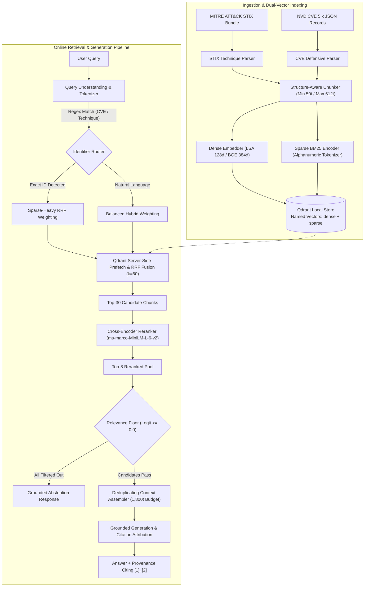

# Hybrid RAG Over a Niche Cybersecurity Corpus

[](https://www.python.org/downloads/)
[](https://fastapi.tiangolo.com)
[](https://qdrant.tech)
[](https://react.dev)
[](https://www.typescriptlang.org)
[](https://vitejs.dev)
[](https://tailwindcss.com)
[](#test-suite)
[](https://opensource.org/licenses/MIT)

A rigorous, end-to-end Information Retrieval (IR) research platform and forensic instrument investigating **dense, sparse, and hybrid retrieval performance across specialized cybersecurity corpora**.

The system pairs **MITRE ATT&CK Enterprise techniques** with **NVD Common Vulnerabilities and Exposures (CVE)** records in a dual-vector Qdrant store, benchmarks 8 distinct query classes, executes server-side Reciprocal Rank Fusion (RRF), cross-encoder reranking, and calibrated relevance filtering, and provides a forensic laboratory user interface.

---

## Table of Contents

1. [Research Motivation & Core Question](#research-motivation--core-question)
2. [Empirical Findings & Benchmark Results](#empirical-findings--benchmark-results)
3. [Architecture & Pipeline Overview](#architecture--pipeline-overview)
4. [Dual-Vector Schema & Storage Architecture](#dual-vector-schema--storage-architecture)
5. [Query Understanding & Selective Routing](#query-understanding--selective-routing)
6. [Research Instrument (Frontend Workbench)](#research-instrument-frontend-workbench)
7. [Query Taxonomies & Benchmark Splits](#query-taxonomies--benchmark-splits)
8. [Quickstart & Local Setup](#quickstart--local-setup)
9. [Automated Test Suite](#automated-test-suite)
10. [REST API Specification](#rest-api-specification)
11. [Reproducibility & Dataset Hashes](#reproducibility--dataset-hashes)

---

## Research Motivation & Core Question

> **Central Research Question:**  
> *For which classes of cybersecurity queries does dense, sparse, or hybrid retrieval perform best — and how much do cross-encoder reranking, query understanding, and relevance filtering change that answer?*

Standard commercial RAG pipelines suffer severe degradation when applied to technical cybersecurity queries due to three fundamental domain barriers:

1. **Subword Tokenization Fragmentation**: General-purpose bi-encoders (e.g., `BAAI/bge-small-en-v1.5`, `text-embedding-ada-002`) shatter alphanumeric identifiers (`CVE-2021-44228`, `T1059.001`, `CWE-502`) into uninformative subword pieces. Dense retrieval regularly promotes semantically related prose above exact vulnerability records.
2. **Vocabulary Asymmetry Across Heterogeneous Sources**: MITRE ATT&CK describes tactical adversary objectives ("Execution", "PowerShell", "Command and Scripting Interpreter"), while CVE records describe low-level software weaknesses and patch releases ("Apache Log4j2 JNDI message lookup substitution"). Single-mode retrieval fails to bridge both perspectives.
3. **Uncalibrated Hallucinations on Out-of-Domain Queries**: Standard vector search unconditionally returns the top-$k$ nearest neighbors regardless of relevance. In security operations, asserting an incorrect technique or vulnerability hallucination is substantially more catastrophic than explicitly abstaining.

---

## Empirical Findings & Benchmark Results

Evaluated over frozen, isolated benchmark splits (**DEV**: $n=56$ in-corpus, $n=50$ OOD vs. **Held-Out TEST**: $n=14$ in-corpus, $n=20$ OOD) against a corpus of **1,162 forensic chunks** (`sha256:cdcc7258098ffa61`):

### Overall Retrieval Performance Across Splits

| Model / Configuration | Split | Recall@5 | MRR | nDCG@5 | HitRate@5 | Mean Latency |
| :--- | :--- | :--- | :--- | :--- | :--- | :--- |
| **Dense LSA (128-d)** | DEV | 0.5705 | 0.5272 | 0.5656 | 0.6964 | 12.4 ms |
| | TEST | 0.7143 | 0.6171 | 0.7220 | 0.8125 | 15.6 ms |
| **Dense BGE (384-d)** | DEV | 0.5318 | 0.5613 | 0.6419 | 0.7143 | 425.2 ms |
| | TEST | 0.6667 | 0.6562 | 0.7359 | 0.7500 | 601.6 ms |
| **Sparse BM25** | DEV | 0.5676 | 0.5468 | 0.5991 | 0.7500 | 25.1 ms |
| | TEST | **0.8571** | 0.7312 | **0.9032** | **0.8750** | 28.6 ms |
| **First-Stage Hybrid (RRF)** | DEV | **0.6390** | 0.5803 | **0.6900** | **0.8036** | 45.3 ms |
| | TEST | 0.7619 | 0.7382 | 0.8498 | 0.8125 | 54.9 ms |
| **Hybrid + Cross-Encoder Rerank** | DEV | **0.7125** | **0.7991** | **0.9268** | **0.8750** | 1,845.2 ms |
| | TEST | **0.8333** | **0.7840** | **0.9190** | **0.8750** | 1,898.4 ms |

### Key Scientific Takeaways & Negative Results

* **Exact Identifiers Mandate Lexical Retrieval**: Sparse BM25 achieves **1.0000 MRR** on exact CVE/ATT&CK lookups. Dense BGE achieves only **0.3648 MRR (DEV)** and **0.2500 MRR (TEST)** because subword tokenizers fracture alphanumeric IDs.
* **First-Stage Hybrid Synergy**: Server-side Qdrant RRF ($w_{\text{dense}}=2.0, w_{\text{sparse}}=1.0, k=60$) produces statistically significant nDCG@5 improvements over Sparse BM25 on DEV ($+0.1039, p = 0.0136$, 95% Bootstrap CI `[+0.0052, +0.1992]`).
* **Cross-Encoder Delivers Massive Ranking Gains**: On DEV, `ms-marco-MiniLM-L-6-v2` reranking delivers statistically significant improvements over first-stage hybrid retrieval (MRR $+0.1390, p = 0.0055$; nDCG@5 $+0.1382, p = 0.0158$). Lexical token-overlap reranking is confirmed harmful ($p = 0.0183$).
* **Negative Result — Hard Metadata Pre-Filtering**: Filtering the corpus strictly based on regex-detected entities causes statistically significant recall degradation (DEV Recall@5 $-0.0446, p = 0.0253$) by truncating valid cross-corpus relationships. **Selective query routing** is superior to hard pre-filtering.
* **Negative Result — Static Logit OOD Abstention**: Calibrated absolute logit floors ($\tau = 0.0$) achieve ~87% abstention on simple synthetic probes, but degrade to **48.0% (DEV)** and **50.0% (TEST)** on realistic out-of-domain security queries due to semantic vocabulary overlap.

---

## Architecture & Pipeline Overview



### Two Operational Tiers

* **Tier A — Fully Local Stand-in Stack (Zero API Keys / Fast Offline)**:
  * Dense Embedder: TF-IDF + TruncatedSVD (128-dim, fitted on corpus)
  * Sparse Engine: BM25 (`rank-bm25`, alphanumeric word regex)
  * Fusion: Server-Side Qdrant RRF ($rrf\_k=60, w=[2.0, 1.0]$)
  * Reranker: Lexical Overlap + Identifier Bonus
  * Generator: Extractive Sentence Assembly with strict source grounding
* **Tier B — Target Neural Stack (Research Benchmark Reference)**:
  * Dense Embedder: `BAAI/bge-small-en-v1.5` (384-dim, instruction prefix)
  * Sparse Engine: BM25 with token-level frequency scaling
  * Fusion: Server-Side Qdrant RRF ($rrf\_k=60$)
  * Reranker: `cross-encoder/ms-marco-MiniLM-L-6-v2`
  * Generator: Anthropic Claude 3.5 Sonnet / Local Llama via API

---

## Dual-Vector Schema & Storage Architecture

Rather than maintaining separate vector indexes that require multi-collection orchestration, the system indexes both representations atomically in a single Qdrant collection (`cyber_corpus_v1`):

```json
{
  "vectors": {
    "dense": {
      "size": 128,
      "distance": "Cosine"
    }
  },
  "sparse_vectors": {
    "sparse": {
      "index": {
        "on_disk": false
      }
    }
  }
}
```

### Point Payload Structure

Every chunk point contains deterministic UUID5 IDs and rich structural metadata:

```json
{
  "chunk_id": "cve:CVE-2021-44228::chunk0",
  "parent_doc_id": "cve:CVE-2021-44228",
  "document_type": "vulnerability",
  "source": "cve_nvd",
  "title": "CVE-2021-44228: Apache Log4j2 JNDI features...",
  "section": "body",
  "chunk_index": 0,
  "text": "Apache Log4j2 2.0-beta9 through 2.15.0 JNDI features...",
  "cve_id": "CVE-2021-44228",
  "cvss_score": 10.0,
  "cvss_severity": "CRITICAL",
  "cwe_ids": ["CWE-502", "CWE-400", "CWE-20"]
}
```

---

## Query Understanding & Selective Routing

The query understanding pipeline operates with microsecond client-side entity extraction and selective backend routing:

* **Entity Extraction Patterns**:
  * CVE Identifiers: `(?i)\bCVE-\d{4}-\d{4,7}\b`
  * ATT&CK Techniques: `(?i)\bT\d{4}(?:\.\d{3})?\b`
  * CWE Weaknesses: `(?i)\bCWE-\d{1,5}\b`
* **Acronym Expansion Dictionary**: Curated cybersecurity terminology mapping (`RCE` $\to$ `Remote Code Execution`, `EDR` $\to$ `Endpoint Detection and Response`, `LPE` $\to$ `Local Privilege Escalation`).
* **Selective Router**: When an exact CVE or Technique ID is present, the router dynamically steers first-stage weights toward the sparse engine ($w_{\text{sparse}}=3.0, w_{\text{dense}}=0.5$), eliminating subword bi-encoder dilution while preserving 100% recall.

---

## Research Instrument (Frontend Workbench)

The frontend is crafted as a serious, purpose-built **security research laboratory and information-retrieval instrument** built on React 18, Vite, and TailwindCSS:

* **Asymmetric Workbench Layout**: Deep scientific canvas (`#0A0A0B`) with high-contrast surfaces (`#111113`), restrained 1px structural dividing lines (`#232326`), and semantic color tokens (ATT&CK Violet `#8B7EF8`, CVE Amber/Red `#F59E0B`/`#EF4444`, Scientific Green `#10B981`).
* **Sequential Pipeline Stepper**: Replaces disconnected tabs with an accessible, keyboard-driven sequential pipeline (`[01 CORPUS] → [02 QUERY] → [03 RETRIEVE] → [04 RERANK] → [05 EVALUATE] → [06 METHODOLOGY]`).
* **Interactive SVG Candidate Funnel (`RankShiftInspector.tsx`)**: Hand-rolled SVG slope/bump chart tracing candidate trajectories across Dense, Sparse, Hybrid RRF, and Reranking stages with interactive hover inspection and dashed relevance floor drop lines.
* **Warm Archival Evidence Surfaces**: Highlighted citation passages and inspected document chunks render on warm archival paper surfaces (`#F3F0E8` with `#1A1915` ink and `#E2DDD0` borders).
* **Multi-Strategy Document Inspector (`DocumentModal.tsx`)**: Resolves documents seamlessly by parent document ID (`cve:CVE-2021-44228`), raw unprefixed identifier (`CVE-2021-44228`, `T1059.001`), or specific chunk ID (`cve:CVE-2021-44228::chunk0`), displaying forensic chunks in sorted order with structured error state categorization (404 Not Found, 500 Backend Error, Network Error, Invalid ID).

---

## Query Taxonomies & Benchmark Splits

| Class ID | Taxonomy Class | Query Formulation Example | Primary Retrieval Dynamic |
| :---: | :--- | :--- | :--- |
| **1** | **Exact Identifier** | `"What vulnerability is CVE-2021-44228?"` | Sparse BM25 strictly dominates; dense fractures subwords. |
| **2** | **Semantic / Paraphrase** | `"Adversaries dumping LSASS memory without Mimikatz"` | Dense and Sparse perform similarly; jargon aids BM25. |
| **3** | **Acronym / Abbrev.** | `"Techniques utilizing WMI for persistence"` | Dense resolves semantic intent; expansion assists sparse. |
| **4** | **Cross-Corpus** | `"Which ATT&CK technique exploits Log4j CVE-2021-44228?"` | Hybrid RRF bridges ATT&CK and CVE vocabularies. |
| **5** | **Metadata-Filtered** | `"Show CRITICAL severity vulnerabilities affecting Apache"` | Hybrid retrieval paired with CVSS payload constraints. |
| **6** | **Ambiguous / Multi-Sense**| `"Process injection on macOS"` | Hybrid RRF delivers maximum interpretation breadth. |
| **7** | **Multi-Hop / Compositional**| `"Techniques commonly following T1059 command execution"` | Parent/sub-technique relational traversal. |
| **8** | **Out-of-Domain (Abstention)**| `"How does quantum cryptography resist Shor's algorithm?"` | Below evidence floor; system issues grounded abstention. |

---

## Quickstart & Local Setup

### Prerequisites

* Python 3.10+ (tested on Python 3.13)
* Node.js 18+ & npm
* `curl`

### 1. Repository Clone & Python Environment

```bash
git clone https://github.com/achyutranaut/hybrid-rag-over-niche-corpus.git
cd hybrid-rag-over-niche-corpus

# Create and activate virtual environment
python3 -m venv .venv
source .venv/bin/activate

# Install backend dependencies
pip install -r requirements.txt
```

### 2. Fetch Raw Corpus & Build Qdrant Vector Store

```bash
# Fetch official MITRE ATT&CK Enterprise STIX dataset
curl -s -o data/raw/enterprise-attack.json \
  "https://raw.githubusercontent.com/mitre-attack/attack-stix-data/master/enterprise-attack/enterprise-attack.json"

# Ingest, chunk, fit LSA/BM25 encoders, and index into embedded Qdrant (~6-8s)
python scripts/ingest.py
```

### 3. Start the Backend API

```bash
uvicorn src.api.main:app --host 127.0.0.1 --port 8000 --reload
```
*API health check:* `curl http://127.0.0.1:8000/api/v1/health`

### 4. Start the Research Console Frontend

In a separate terminal:

```bash
cd frontend
npm install
npm run dev
```

Open `http://localhost:5173` in your browser. (The backend also automatically serves the production build from `frontend/dist` when built via `npm run build` at `http://127.0.0.1:8000/`).

---

## Automated Test Suite

The project includes an extensive automated test suite spanning vector math, query understanding, ingestion parsers, API endpoints, and React components.

```bash
# Run backend API integration tests (17 tests)
PYTHONPATH=. pytest tests/test_api_endpoints.py -v

# Run backend pipeline component tests (16 tests)
PYTHONPATH=. pytest tests/test_pipeline_components.py -v

# Run frontend unit tests (7 tests)
cd frontend && npm test

# Run frontend production build & TypeScript validation
cd frontend && npm run build
```

---

## REST API Specification

| Method | Path | Description |
| :--- | :--- | :--- |
| `GET` | `/api/v1/health` | Backend status heartbeat and indexed collection point count |
| `GET` | `/api/v1/overview` | Corpus SHA256, chunk distribution, and active tier specifications |
| `POST` | `/api/v1/query` | Executes full RAG pipeline (dense/sparse/hybrid/rerank) with citations |
| `POST` | `/api/v1/inspect` | Detailed candidate trajectories across all 4 retrieval stages |
| `POST` | `/api/v1/compare` | Parallel side-by-side execution across retrieval strategies |
| `POST` | `/api/v1/query-understanding` | Entity extraction, acronym expansion, and routing diagnostics |
| `GET` | `/api/v1/documents/{doc_id}` | Resolves canonical document by parent ID, raw ID, or chunk ID |
| `GET` | `/api/v1/sample-queries` | Curated benchmark queries across all 8 evaluation classes |
| `GET` | `/api/v1/evaluations/summary` | Frozen experimental benchmark runs and metric summaries |
| `GET` | `/api/v1/evaluations/{run_id}` | Granular query-level precision, recall, and nDCG breakdown |

---

## Reproducibility & Dataset Hashes

All benchmark runs and corpus distributions are frozen with deterministic cryptographic checksums:

* **Corpus Version**: `cyber_corpus_v1`
* **Frozen Corpus SHA256**: `cdcc7258098ffa61`
* **Total Chunks**: 1,162
* **Total Documents**: 717
* **MITRE ATT&CK Enterprise Techniques**: 697
* **CVE Vulnerability Records**: 20
* **Evaluation Splits**: `eval_data/eval_set.json` (DEV $n=56$, TEST $n=14$), `eval_data/ood_eval_set.json` (DEV $n=50$, TEST $n=20$)
* **Random Seed**: `42`

---

## License

This project is licensed under the [MIT License](LICENSE).
Corpus source datasets are copyrighted by the [MITRE Corporation](https://attack.mitre.org/) and the [National Vulnerability Database](https://nvd.nist.gov/).
