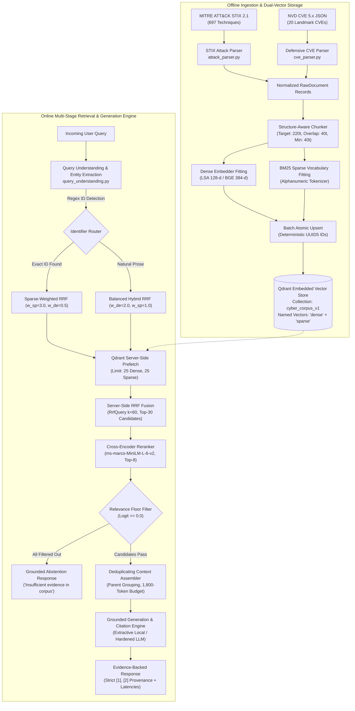

# Hybrid RAG Over a Niche Cybersecurity Corpus

[](https://www.python.org/downloads/)
[](https://fastapi.tiangolo.com)
[](https://qdrant.tech)
[](https://react.dev)
[](https://www.typescriptlang.org)
[](https://vitejs.dev)
[](#automated-test-suite)
[](https://opensource.org/licenses/MIT)

An Information Retrieval (IR) research platform and forensic workbench investigating **dense semantic retrieval, sparse lexical retrieval, and hybrid fusion over specialized cybersecurity corpora**.

The system pairs **MITRE ATT&CK Enterprise techniques** with **NVD Common Vulnerabilities and Exposures (CVE)** records in a dual-vector Qdrant store, benchmarks 8 distinct query taxonomies, executes server-side Reciprocal Rank Fusion (RRF), cross-encoder reranking, and calibrated relevance-floor filtering, and provides an interactive research console with a 3D WebGL pipeline inspector.

---

## Table of Contents

1. [Executive Overview & Core Research Question](#executive-overview--core-research-question)
2. [Domain Problem Statement & Technical Challenges](#domain-problem-statement--technical-challenges)
3. [Why Hybrid RAG? Retrieval Mechanics & Formulations](#why-hybrid-rag-retrieval-mechanics--formulations)
4. [System Architecture & Dual Operational Tiers](#system-architecture--dual-operational-tiers)
5. [End-to-End Retrieval & Generation Pipeline](#end-to-end-retrieval--generation-pipeline)
6. [Dataset & Corpus Specification](#dataset--corpus-specification)
7. [Technology Stack](#technology-stack)
8. [Repository Structure](#repository-structure)
9. [Research Console & Workbench](#research-console--workbench)
10. [End-to-End Query Walkthrough](#end-to-end-query-walkthrough)
11. [Empirical Findings & Held-Out Benchmark Results](#empirical-findings--held-out-benchmark-results)
12. [Documented Negative Results & Forensic Counter-Evidence](#documented-negative-results--forensic-counter-evidence)
13. [REST API Reference](#rest-api-reference)
14. [Local Installation & Setup](#local-installation--setup)
15. [Centralized Configuration & Environment Variables](#centralized-configuration--environment-variables)
16. [Automated Test Suite](#automated-test-suite)
17. [Architectural Decisions & Trade-Off Rationale](#architectural-decisions--trade-off-rationale)
18. [Security & Anti-Prompt-Injection Defenses](#security--anti-prompt-injection-defenses)
19. [Known Limitations & Threats to Validity](#known-limitations--threats-to-validity)
20. [Engineering Roadmap & Future Work](#engineering-roadmap--future-work)
21. [Contributing](#contributing)
22. [License & Data Attribution](#license--data-attribution)
23. [Author](#author)

---

## Executive Overview & Core Research Question

Standard Retrieval-Augmented Generation (RAG) benchmarks typically evaluate general-domain question answering over clean Wikipedia or news prose. When deployed in technical domains like cybersecurity, standard dense bi-encoders suffer severe degradation because queries mix **exact alphanumeric identifiers** with **abstract tactical descriptions**.

This repository is built to systematically investigate that tension:

> **Central Research Question:**  
> *For which classes of cybersecurity queries does dense, sparse, or hybrid retrieval perform best — and how much do cross-encoder reranking, query understanding, and relevance filtering change that answer?*

The system is not built on the dogmatic assumption that hybrid retrieval is always optimal. Instead, it provides a quantitative testbed across frozen benchmark splits (**DEV**: $n=56$ in-corpus, $n=8$ Class-8, $n=50$ expanded OOD; **Held-Out TEST**: $n=14$ in-corpus, $n=2$ Class-8, $n=20$ expanded OOD) over an indexed corpus of **717 documents and 1,162 forensic chunks** (`sha256:cdcc7258098ffa61`).

---

## Domain Problem Statement & Technical Challenges

Cybersecurity information retrieval exhibits four structural characteristics that challenge standard information retrieval architectures:

```
┌────────────────────────────────────────────────────────────────────────────────────────┐
│                        CYBERSECURITY RETRIEVAL CHALLENGES                              │
├────────────────────────────┬────────────────────────────┬──────────────────────────────┤
│ 1. Subword Fragmentation   │ 2. Vocabulary Asymmetry    │ 3. Uncalibrated Abstention   │
│ Alphanumeric identifiers   │ Tactical adversary prose   │ Nearest-neighbor search      │
│ (CVE-2021-44228, T1059.001)│ (MITRE ATT&CK) vs low-     │ returns top-k unconditionally;│
│ are shattered by subword   │ level software weaknesses  │ asserting hallucinated CVEs  │
│ tokenizers into fragments. │ (NVD CVE descriptions).    │ is catastrophic in SOC ops.  │
└────────────────────────────┴────────────────────────────┴──────────────────────────────┘
```

1. **Subword Tokenization Fragmentation**: General-purpose bi-encoders (e.g., `BAAI/bge-small-en-v1.5`, OpenAI `text-embedding-3-small`) tokenize alphanumeric identifiers like `CVE-2021-44228` into fragmented pieces (`cve`, `-`, `2021`, `-`, `44228`). Consequently, distinct vulnerabilities with overlapping digits map to near-identical embedding vectors, whereas lexical tokenizers treat them as distinct atomic keys.
2. **Vocabulary Asymmetry Across Heterogeneous Corpora**: MITRE ATT&CK describes adversary objectives at the behavioural level (*"Adversaries may dump credentials from the LSASS process to obtain account logon credentials"*), whereas CVE records describe specific software flaws and commit patches (*"Apache Log4j2 JNDI features used in configuration do not protect against attacker controlled LDAP"*). A query seeking the technique behind a vulnerability must bridge two fundamentally disjoint vocabularies.
3. **Uncalibrated Hallucinations on Out-of-Domain Queries**: Vector similarity search is uncalibrated: it unconditionally returns the top-$k$ nearest points regardless of whether any relevant evidence exists. In incident response and security forensics, asserting a false technique or hallucinated mitigation is far more dangerous than abstaining with an explicit negative acknowledgment.
4. **Acronym & Jargon Density**: Queries frequently employ abbreviations (`RCE`, `LPE`, `EDR`, `C2`, `LSASS`, `WMI`) that require either semantic representation or controlled domain expansion without introducing lexical noise.

---

## Why Hybrid RAG? Retrieval Mechanics & Formulations

To address these challenges, the platform implements a multi-stage retrieval architecture combining complementary retrieval strategies:

```
Dense Semantic Vector Search          Sparse Lexical BM25 Search
(BAAI/bge-small or LSA 128-d)          (Custom Alphanumeric Tokenizer)
   [Good for: Paraphrase, Intent]         [Good for: Exact IDs, Rare Terms]
                 \                              /
                  \                            /
             Server-Side Reciprocal Rank Fusion (RRF)
                  RRF(d) = Σ w_i / (k + r_i(d))
                                │
                      Candidate Pool (k=30)
                                │
                    Second-Stage Cross-Encoder
                 (ms-marco-MiniLM-L-6-v2 Reranker)
                                │
                    Relevance-Floor Filtering
                  (Calibrated Logit Floor >= 0.0)
                                │
                  Context Assembly & Generation
```

### 1. Complementary Retrieval Strengths

| Retrieval Dimension | Dense Semantic Retrieval | Sparse Lexical Retrieval (BM25) | First-Stage Hybrid RRF |
| :--- | :--- | :--- | :--- |
| **Matching Mechanism** | Cosine distance in embedding space | Token saturation $\times$ Inverse Document Frequency | Rank-based reciprocal summation |
| **Exact Identifiers (`CVE-2021-44228`)** | Fails (fractures into subwords; MRR 0.25–0.36) | **Dominates (Exact match; MRR 1.0000)** | **Preserves Rank 1 placement** |
| **Semantic Paraphrase** | Captures intent and synonyms | Vulnerable to vocabulary mismatch | Bridges terminology gaps |
| **Acronyms & Technical Slang** | Resolves high-level intent | Dependent on exact token match | Balances semantic intent with lexical anchor |

### 2. Reciprocal Rank Fusion (RRF)

Linear combination of scores ($\alpha \cdot s_{\text{dense}} + (1 - \alpha) \cdot s_{\text{sparse}}$) is unstable because cosine similarities $[-1, 1]$ and BM25 scores $[0, \infty)$ have radically different distributions and dynamic ranges. RRF eliminates score calibration by operating purely on ranked positions:

$$RRF(d) = \sum_{m \in M} \frac{w_m}{k + r_m(d)}$$

Where:
* $M = \{\text{dense}, \text{sparse}\}$ represents the retriever channels.
* $r_m(d) \in [1, K]$ is the 1-based rank position of document chunk $d$ in channel $m$.
* $k$ is the smoothing constant (default $k = 60$), preventing high ranks from disproportionately penalizing candidates near the retrieval boundary.
* $w_m$ represents per-channel weighting ($w_{\text{dense}} = 2.0, w_{\text{sparse}} = 1.0$, dynamically adjusted by the query router).

### 3. Second-Stage Cross-Encoder Reranking

First-stage retrievers evaluate query and chunk representations independently (bi-encoder dot product or inverted index lookup). In contrast, the cross-encoder (`cross-encoder/ms-marco-MiniLM-L-6-v2`) performs full all-to-all cross-attention over the concatenated `(query, document_text)` pair:

$$\text{score}_{\text{CE}}(q, d) = \text{CrossEncoder}(q \circ d)$$

This captures complex semantic interactions and syntactic negation that bi-encoders miss, rescuing buried relevant passages from rank 15–30 to rank 1.

### 4. Relevance-Floor Filtering

To prevent the generator from hallucinating over irrelevant candidates on out-of-domain queries, candidates are subjected to a calibrated relevance floor prior to context assembly:
* **Relative Score Floor**: Discards candidates where $\text{score} < \text{score}_{\text{top}} \times \tau$ (default $\tau = 0.2$).
* **Absolute Logit Floor**: For cross-encoder reranking, discards candidates whose raw classification logit falls below $\tau_{\text{abs}} = 0.0$. If zero candidates survive, the pipeline emits a grounded abstention response.

---

## System Architecture & Dual Operational Tiers



### Dual Operational Tiers

The system is architected around two interchangeable configuration tiers, controlled via centralized configuration (`src/config.py`):

| Pipeline Component | Tier A — Local Stand-in Stack (Default) | Tier B — Target Neural Stack (Research Reference) |
| :--- | :--- | :--- |
| **Operational Goal** | 100% offline, zero API keys, no network downloads | High-capacity neural inference for formal benchmarks |
| **Dense Embedder** | TF-IDF + TruncatedSVD (128-d LSA, fit on corpus) | `BAAI/bge-small-en-v1.5` (384-d, instruction prefix) |
| **Sparse Engine** | BM25 (`rank-bm25`, alphanumeric regex tokenizer) | BM25 (`rank-bm25`, alphanumeric regex tokenizer) |
| **First-Stage Fusion** | Server-side Qdrant RRF ($rrf\_k=60, w=[2.0, 1.0]$) | Server-side Qdrant RRF ($rrf\_k=60, w=[2.0, 1.0]$) |
| **Second-Stage Reranker** | Lexical token-overlap + identifier boost | `cross-encoder/ms-marco-MiniLM-L-6-v2` |
| **Generation Provider** | `ExtractiveLocalProvider` (verbatim cited sentences) | `AnthropicProvider` (Claude 3.5) / `LocalLlamaProvider` |
| **Grounding Assurance** | Grounded by construction (100% corpus sentences) | Hardened XML tag delimiters + anti-injection prompt |
| **Total Query Latency** | **35–55 ms** | **1,850–1,950 ms (PyTorch CPU)** |

---

## End-to-End Retrieval & Generation Pipeline

Every query executes through nine distinct pipeline stages:

```
[01 Ingestion] ──> [02 Chunking] ──> [03 Indexing] ──> [04 Query Understanding]
       │
       ▼
[05 Parallel Retrieval] ──> [06 Server RRF] ──> [07 Reranking] ──> [08 Floor Filtering]
       │
       ▼
[09 Context Assembly & Grounded Generation]
```

### 1. Ingestion & Normalization (`src/ingestion/`)
* Parses Enterprise MITRE ATT&CK STIX 2.1 bundles into `RawDocument` objects, extracting technique IDs (`T1059.001`), tactics, detection guidance, and platforms while stripping citation artifacts.
* Parses NVD CVE 5.x JSON vulnerability feeds into `RawDocument` objects, extracting CVE IDs (`CVE-2021-44228`), CVSS v3.1 base scores, severity metrics, and CWE classifications (`CWE-502`).

### 2. Structure-Aware Chunking (`src/ingestion/chunker.py`)
* Rather than naive token-window slicing that fragments tables or CVSS descriptions, chunking aligns with markdown structural headings (`## Section`).
* Target chunk size: **220 tokens**; overlap window: **40 tokens**; minimum chunk floor: **40 tokens** (tiny trailing fragments are merged into predecessor chunks to avoid low-signal vectors).
* Every chunk retains its `parent_doc_id` and structural section metadata.

### 3. Dual-Vector Indexing (`src/retrieval/qdrant_store.py`)
* Operates a single Qdrant collection (`cyber_corpus_v1`) configured with two named vectors per point:
  * `dense`: 128-d (LSA) or 384-d (BGE), Cosine distance.
  * `sparse`: Native Qdrant sparse vectors indexed with inverted index support.
* Point IDs are deterministic `UUID5` hashes of `chunk_id`, guaranteeing idempotent upserts.

### 4. Query Understanding & Routing (`src/retrieval/query_understanding.py`)
* Microsecond deterministic regex entity extraction:
  * CVE IDs: `\bCVE-\d{4}-\d{4,7}\b`
  * ATT&CK Technique IDs: `\bT\d{4}(?:\.\d{3})?\b`
  * CWE IDs: `\bCWE-\d+\b`
* Curated additive acronym expansion (e.g., `RCE` $\to$ `remote code execution`, `credential dumping` $\to$ `LSASS, SAM, NTDS`).
* **Selective Router**: Steers queries containing exact IDs toward sparse-weighted retrieval ($w_{\text{sparse}} = 3.0, w_{\text{dense}} = 0.5$).

### 5. Parallel Dense & Sparse Retrieval (`src/retrieval/qdrant_store.py`)
* Executes parallel candidate generation directly inside Qdrant via `models.Prefetch`:
  * Dense channel retrieves top-$k_{\text{dense}} = 25$ nearest neighbors.
  * Sparse channel retrieves top-$k_{\text{sparse}} = 25$ lexical matches.

### 6. Server-Side Reciprocal Rank Fusion (`src/retrieval/qdrant_store.py`)
* Merges prefetch streams directly inside Qdrant using `models.RrfQuery(rrf=models.Rrf(k=60))` into a unified candidate pool of $k_{\text{fused}} = 30$ chunks without roundtrip client overhead.

### 7. Second-Stage Reranking (`src/retrieval/reranker.py`)
* Evaluates all 30 candidate chunks using `cross-encoder/ms-marco-MiniLM-L-6-v2` (or Tier A lexical overlap) to re-score query-document pairs, outputting the top $k_{\text{rerank}} = 8$ candidates.

### 8. Relevance-Floor Filtering (`src/rag_pipeline.py`)
* Applies logit floor $\ge 0.0$. If all candidate logits are negative, marks the query as out-of-domain and triggers immediate abstention.

### 9. Context Assembly & Grounded Generation (`src/retrieval/context.py`, `src/generation/provider.py`)
* **Deduplication**: Retains only the highest-scoring chunk per `(parent_doc_id, section)`.
* **Structural Grouping**: Groups surviving chunks by parent document, preserving internal `chunk_index` ordering.
* **Token Budgeting**: Enforces a strict **1,800-token ceiling** without truncating sentences mid-chunk.
* **Citation Generation**: Formats output with deterministic source attribution (`[1]`, `[2]`), mapping claims to forensic metadata.

---

## Dataset & Corpus Specification

The benchmark corpus consists of authentic, un-synthesized cybersecurity threat intelligence:

| Dimension | Specification | Verification Hash |
| :--- | :--- | :--- |
| **Corpus Name** | `cyber_corpus_v1` | `sha256:cdcc7258098ffa61` |
| **Total Indexed Chunks** | 1,162 chunks | Verified via `GET /api/v1/health` |
| **Total Source Documents** | 717 documents | 697 ATT&CK techniques + 20 NVD CVEs |
| **Enterprise ATT&CK Source** | STIX 2.1 Enterprise Matrix v14.1 | `data/raw/enterprise-attack.json` (53 MB) |
| **NVD CVE Source** | Official NVD CVE 5.x JSON Feeds | `data/raw/cves/` (20 landmark vulnerabilities) |
| **Chunking Parameters** | 220 target tokens, 40 overlap tokens, 40 min tokens | Structure-aware header alignment |
| **Vectors Per Point** | 2 named vectors (`dense` + `sparse`) | Synchronized atomic upsert |

### Curated Landmark CVE Records

The 20 CVE records in `data/raw/cves/` span major vulnerability classes:
* **Log4Shell** (`CVE-2021-44228`, `CVE-2021-44832`): JNDI injection / RCE.
* **EternalBlue** (`CVE-2017-0144`): SMBv1 remote code execution.
* **Heartbleed** (`CVE-2014-0160`): OpenSSL memory information leak.
* **Zerologon** (`CVE-2020-1472`): Netlogon elevation of privilege.
* **ProxyLogon** (`CVE-2021-26855`): Microsoft Exchange Server authentication bypass.
* **PrintNightmare** (`CVE-2021-34527`): Windows Print Spooler RCE / LPE.
* **BlueKeep** (`CVE-2019-0708`): Windows Remote Desktop Protocol flaw.
* **Follina** (`CVE-2022-30190`): Microsoft Windows Support Diagnostic Tool (MSDT) RCE.
* **Atlassian Confluence OGNL** (`CVE-2022-26134`), **FortiOS SSL VPN** (`CVE-2018-13379`), **MOVEit Transfer SQLi** (`CVE-2023-34362`).

### Point Payload Schema

Every Qdrant point stores structured forensic metadata:

```json
{
  "id": "c71e9894-1a3b-5544-934c-2b9921f00889",
  "vector": {
    "dense": [0.0412, -0.0156, "... (128 or 384 dims)"],
    "sparse": {
      "indices": [1042, 4892, 12049],
      "values": [3.142, 1.895, 4.021]
    }
  },
  "payload": {
    "chunk_id": "cve:CVE-2021-44228::chunk0",
    "parent_doc_id": "cve:CVE-2021-44228",
    "source": "cve_nvd",
    "document_type": "vulnerability",
    "title": "CVE-2021-44228: Apache Log4j2 JNDI Remote Code Execution",
    "section": "body",
    "chunk_index": 0,
    "cve_id": "CVE-2021-44228",
    "cvss_score": 10.0,
    "cvss_severity": "CRITICAL",
    "cwe_ids": ["CWE-502", "CWE-400", "CWE-20"],
    "url": "https://nvd.nist.gov/vuln/detail/CVE-2021-44228",
    "text": "Apache Log4j2 2.0-beta9 through 2.15.0 JNDI features..."
  }
}
```

---

## Technology Stack

| Architecture Layer | Technology | Version | Engineering Role & Purpose |
| :--- | :--- | :--- | :--- |
| **Backend Framework** | FastAPI | 0.115+ | High-throughput async REST API serving `/api/v1/...` and static frontend |
| **Data Validation** | Pydantic v2 | 2.10+ | Strict typing, request validation, and payload serialization |
| **ASGI Web Server** | Uvicorn | 0.30+ | High-concurrency production ASGI server |
| **Vector Engine** | Qdrant Client | 1.19+ | Local embedded vector store operating dual named vectors and server-side RRF |
| **Dense IR (Tier A)** | Scikit-Learn | 1.6+ | TF-IDF Vectorizer + TruncatedSVD (128-d LSA semantic space) |
| **Dense IR (Tier B)** | Sentence-Transformers | Optional | `BAAI/bge-small-en-v1.5` 384-d neural bi-encoder with query instruction prefix |
| **Sparse IR** | Rank-BM25 | 0.2.2+ | Robertson/Sparck-Jones BM25 with custom alphanumeric identifier regex |
| **Neural Reranking** | Cross-Encoder | Optional | `cross-encoder/ms-marco-MiniLM-L-6-v2` for query-document joint cross-attention |
| **Frontend Framework** | React | 19.2 | Modern UI library with component composition and strict typing |
| **Language** | TypeScript | 5.6 / 6.0 | Strict end-to-end interface contracts between API responses and UI models |
| **Build & Tooling** | Vite | 8.3 | Lightning-fast ESM build tool, dev proxy, and static bundler |
| **Styling & Theme** | Tailwind CSS | 3.4 | Cybersecurity research console design system (`#080b11` deep canvas) |
| **Iconography** | Lucide React | 1.47+ | Domain icons (Shield, Terminal, Sliders, Cpu, GitBranch, BarChart2) |
| **3D Visualization** | Three.js | 0.186+ | Interactive WebGL rendering of the 9-stage information retrieval pipeline |
| **Statistical Eval** | NumPy & SciPy | 2.1+ / 1.14+ | Wilcoxon signed-rank tests, 95% bootstrap confidence intervals, Cohen's $d$ |
| **Automated Testing** | Pytest & Vitest | 8.0+ / 5.0+ | Automated backend API/component integration and frontend unit validation |

---

## Repository Structure

```
hybrid-rag-over-niche-corpus/
├── data/
│   ├── raw/
│   │   ├── enterprise-attack.json        # 53MB MITRE ATT&CK STIX 2.1 Enterprise bundle
│   │   └── cves/                         # 20 curated NVD CVE 5.x JSON vulnerability feeds
│   ├── processed/                        # Tier A fitted models (embedder.pkl, sparse.pkl)
│   └── processed_bge/                    # Tier B BGE fitted models (sparse.pkl)
├── eval_data/
│   ├── eval_set.json                     # In-corpus benchmark queries (n=70: 56 DEV, 14 TEST)
│   ├── eval_set_dev10.json               # Fast 10-query development sanity slice
│   └── ood_eval_set.json                 # Expanded realistic OOD queries (n=70: 50 DEV, 20 TEST)
├── experiments/
│   ├── b1_results_dev.json               # Baseline embedder evaluations (DEV split)
│   ├── b1_results_test.json              # Baseline embedder evaluations (Held-Out TEST split)
│   ├── b2_results_dev.json               # Cross-encoder & relevance floor evaluations (DEV)
│   ├── b2_results_test.json              # Cross-encoder & relevance floor evaluations (TEST)
│   ├── e2_results.json                   # RRF fusion parameter sweeps (k-sweeps, weights)
│   ├── e3_results.json                   # Relevance floor threshold calibration sweeps
│   ├── e4_results_dev.json               # Query understanding & routing ablations (DEV)
│   ├── e4_results_test.json              # Query understanding & routing ablations (TEST)
│   ├── statistical_test_results.json     # Paired bootstrap 95% CIs, Wilcoxon p, Cohen's d
│   ├── final_test_summary.md             # Formal held-out test evaluation report
│   └── run_experiments.py                # Automated reproducible benchmark execution runner
├── frontend/
│   ├── src/
│   │   ├── api/client.ts                 # Fully-typed API client for all /api/v1 endpoints
│   │   ├── assets/hero.png               # Research console hero brand asset
│   │   ├── components/
│   │   │   ├── Navbar.tsx                # Global research header, tab switcher, health badge
│   │   │   ├── OverviewDashboard.tsx     # Section 1: Corpus statistics, research RQ, tier specs
│   │   │   ├── RagPlayground.tsx         # Section 2: Interactive search, citations, strategy comp
│   │   │   ├── RetrievalInspector.tsx    # Section 3: 4-column candidate funnel & rank tracker
│   │   │   ├── RankShiftInspector.tsx    # Interactive SVG slope/bump candidate trajectory chart
│   │   │   ├── QueryUnderstandingView.tsx# Section 4: Regex ID detection, acronym expansion, router
│   │   │   ├── EvaluationDashboard.tsx   # Section 5: Frozen DEV vs Held-Out TEST benchmarks
│   │   │   ├── ArchitectureView.tsx      # Section 6: Interactive 9-stage pipeline stepper
│   │   │   ├── Pipeline3DCanvas.tsx      # Three.js WebGL 3D interactive pipeline visualization
│   │   │   ├── MethodologyView.tsx       # Section 7: Scientific methodology, splits, limitations
│   │   │   └── DocumentModal.tsx         # Multi-strategy parent & chunk document forensic viewer
│   │   └── types/api.ts                  # Strict TypeScript interfaces matching backend models
│   ├── package.json                      # React 19, Vite 8, Tailwind CSS, Three.js dependencies
│   └── vite.config.ts                    # Vite build configuration with API proxy
├── scripts/
│   ├── ingest.py                         # Ingestion script: parses raw data, builds Qdrant index
│   ├── ingest_bge.py                     # Ingestion script for Tier B neural BGE embeddings
│   ├── query.py                          # CLI query interface with strategy and JSON flags
│   └── validate_eval_set.py              # Cryptographic validator for benchmark evaluation sets
├── src/
│   ├── api/
│   │   └── main.py                       # FastAPI application serving endpoints & frontend assets
│   ├── eval/
│   │   ├── metrics.py                    # Metric calculators: Recall@K, MRR, nDCG@K, HitRate@K
│   │   └── reproducibility.py            # Corpus hashing, artifact checksums, seed management
│   ├── generation/
│   │   └── provider.py                   # Extractive local generator & hardened Anthropic LLM
│   ├── ingestion/
│   │   ├── attack_parser.py              # STIX 2.1 parser for MITRE ATT&CK techniques
│   │   ├── cve_parser.py                 # Defensive parser for NVD CVE 5.x JSON feeds
│   │   ├── chunker.py                    # Structure-aware heading/paragraph chunking engine
│   │   └── pipeline.py                   # End-to-end ingestion and store loading routines
│   ├── retrieval/
│   │   ├── context.py                    # Context assembler: deduplication, grouping, token budget
│   │   ├── embeddings.py                 # Dense providers: TfidfSvd (Tier A) & SentenceTransformers
│   │   ├── qdrant_store.py               # Qdrant client wrapper: dual vectors, prefetch & RRF
│   │   ├── query_understanding.py        # Regex extraction, acronym glossary, selective router
│   │   ├── reranker.py                   # Lexical overlap scorer & CrossEncoder reranker
│   │   └── sparse.py                     # Custom alphanumeric BM25 encoder & tokenizer
│   ├── config.py                         # Centralized typed dataclass configuration from env vars
│   └── rag_pipeline.py                   # Unified RAG execution engine for API and experiments
├── storage/
│   └── qdrant/                           # Embedded Qdrant RocksDB collection data directory
├── tests/
│   ├── fixtures/sample_attack_bundle.json# Minimal STIX fixture for isolated testing
│   ├── test_api_endpoints.py             # 17 integration tests verifying FastAPI endpoints
│   └── test_pipeline_components.py       # 16 unit tests verifying math, chunking, and filters
├── ARCHITECTURE.md                       # Comprehensive 87KB design & empirical research document
├── pyproject.toml                        # Build system configuration & Python package metadata
├── requirements.txt                      # Production backend dependencies
└── README.md                             # Project documentation
```

---

## Research Console & Workbench

The frontend is implemented as an information-retrieval instrument and forensic laboratory workbench:


### Workbench Views

1. **Overview Dashboard (`OverviewDashboard.tsx`)**:
   * Displays corpus distribution metrics (1,162 chunks, 697 techniques, 20 CVEs, 2 vectors/point).
   * Displays the active operational tier (Tier A Stand-in vs Tier B Neural) and corpus hash (`cdcc7258098ffa61`).
   * Displays held-out evaluation headline results.

2. **RAG Playground (`RagPlayground.tsx`)**:
   * Interactive search input with clickable shortcut pills for all 8 evaluation query classes.
   * Instant strategy toggling: `hybrid_rerank` (default), `hybrid`, `sparse`, and `dense`.
   * Advanced options: Router toggle, Acronym expansion toggle, Relevance floor selector (`off`, `relative`, `absolute`).
   * Latency breakdown strip detailing exact timings for Retrieval, Reranking, Generation, and Total execution.
   * Grounded answer presentation box with attribution badges and interactive citation cards (`[1]`, `[2]`).
   * **Parallel 4-Strategy Comparison**: Executes all 4 retrieval strategies concurrently on the same query, rendering candidate rankings, generated answers, and latencies side-by-side.

3. **Retrieval Inspector (`RetrievalInspector.tsx`)**:
   * 4-column parallel candidate funnel comparing candidate chunks returned by Dense, Sparse, Hybrid RRF, and Reranking.
   * Full chunk metadata inspection (Document ID, title, section name, score, rank, full text).
   * Cross-stage rank movement tracking showing candidate ascents, drops, or prunings.

4. **Rank Shift Inspector (`RankShiftInspector.tsx`)**:
   * Custom SVG bump / slope chart visualizing candidate trajectories across retrieval stages.
   * Tracks candidate flow from initial channel pools through RRF fusion and reranking, highlighting threshold drop-offs.

5. **Query Understanding View (`QueryUnderstandingView.tsx`)**:
   * Real-time deterministic regex detection of CVE, Technique, and CWE identifiers.
   * Additive acronym expansion diagnostics showing expanded query strings.
   * Selective routing decision visualization with empirical audit notes explaining why hard pre-filtering is disabled.

6. **Evaluation Dashboard (`EvaluationDashboard.tsx`)**:
   * Switcher toggling between Development Split ($n=64$) and Held-Out Test Split ($n=16$).
   * Granular experiment selectors: B1 (Embedders), B2 (Rerankers & Floors), E2 (RRF Sweeps), E3 (Floor Calibration), E4 (Query Understanding), and Statistical Tests.
   * Class-by-class Recall@5 breakdown across all 8 taxonomies.
   * Out-of-domain abstention analysis detailing synthetic vs realistic OOD performance.

7. **Architecture View & 3D WebGL Canvas (`ArchitectureView.tsx`, `Pipeline3DCanvas.tsx`)**:
   * Interactive 9-stage stepper with code references, implementation notes, and mathematical formulas.
   * Three.js WebGL canvas visualizing node connections and data flow across pipeline stages.

8. **Document Modal (`DocumentModal.tsx`)**:
   * Forensic modal resolving documents by parent document ID (`cve:CVE-2021-44228`), raw identifier (`CVE-2021-44228`, `T1059.001`), or chunk ID (`cve:CVE-2021-44228::chunk0`).
   * Renders sorted chunk sequences, section titles, and external source references.

---

## End-to-End Query Walkthrough

To understand how the stages interact, consider this benchmark query:

```
Query: "What vulnerability is CVE-2021-44228 and how does it execute remote code?"
Class: Exact Identifier + Semantic Cross-Corpus (Classes 1 & 4)
```

```
1. QUERY UNDERSTANDING
   ├── Detected Entities : CVE-2021-44228 (CVE regex match)
   ├── Acronym Expansion : None (query uses full phrase "remote code")
   └── Router Action     : Detected exact identifier -> Assigns heavy sparse weight (w_sparse=3.0, w_dense=0.5)

2. PARALLEL FIRST-STAGE RETRIEVAL (Top-25 from each channel)
   ├── Dense Search (BGE) : Fractures "CVE-2021-44228" into subwords.
   │                        Ranks relevant Log4j chunk at Rank 4 (Score: 0.712)
   │                        Promotes generic "Remote Code Execution" technique to Rank 1
   └── Sparse Search (BM25): Matches exact token "cve-2021-44228".
                            Ranks relevant Log4j chunk at Rank 1 (Score: 24.812)

3. SERVER-SIDE RECIPROCAL RANK FUSION (k=60, w_sp=3.0, w_de=0.5)
   ├── Log4j Chunk Score  : (3.0 / (60 + 1)) + (0.5 / (60 + 4)) = 0.04918 + 0.00781 = 0.05699
   └── Output Position    : Log4j CVE record emerges at Rank 1 of Top-30 fused candidate pool

4. SECOND-STAGE CROSS-ENCODER RERANKING (ms-marco-MiniLM-L-6-v2)
   ├── Evaluates concatenated: ("What vulnerability is CVE-2021-44228...", chunk.text)
   ├── Assigns high logit (+6.84) to Log4j JNDI description chunk
   └── Output Position    : Confirms Rank 1 in Top-8 pool

5. RELEVANCE FLOOR & CONTEXT ASSEMBLY
   ├── Floor Evaluation  : Logit +6.84 >= 0.0 (PASS)
   ├── Deduplication     : Retains primary description chunk; prunes redundant header chunk
   └── Token Budget      : Context formatted within 1,800-token ceiling with marker [1]

6. GROUNDED GENERATION & PROVENANCE
   └── Generated Answer  : "CVE-2021-44228 (Log4Shell) is a remote code execution vulnerability in
                           Apache Log4j2 JNDI features [1]. An attacker who can control log messages
                           or message parameters can execute arbitrary code loaded from LDAP servers [1]."
```

---

## Empirical Findings & Held-Out Benchmark Results

All evaluations were executed against frozen, split-isolated benchmark sets (`eval_data/eval_set.json` and `eval_data/ood_eval_set.json`). The **held-out TEST split was evaluated strictly once** without post-hoc tuning or threshold adjustments.

### 1. Overall Retrieval Performance Across Splits

Evaluated across in-corpus queries (**DEV**: $n=56$, **TEST**: $n=14$):

| Retrieval Configuration | Split | Recall@5 | MRR | nDCG@5 | HitRate@5 | Mean Latency |
| :--- | :--- | :--- | :--- | :--- | :--- | :--- |
| **Dense LSA (128-d)** | DEV | 0.5705 | 0.5272 | 0.5656 | 0.6964 | 12.4 ms |
| | TEST | 0.7143 | 0.6171 | 0.7220 | 0.8125 | 15.6 ms |
| **Dense BGE (384-d)** | DEV | 0.5318 | 0.5613 | 0.6419 | 0.7143 | 425.2 ms |
| | TEST | 0.6667 | 0.6562 | 0.7359 | 0.7500 | 601.6 ms |
| **Sparse BM25** | DEV | 0.5676 | 0.5468 | 0.5991 | 0.7500 | 25.1 ms |
| | TEST | **0.8571** | 0.7312 | **0.9032** | **0.8750** | 28.6 ms |
| **Hybrid LSA (RRF)** | DEV | 0.6271 | 0.5938 | 0.6756 | 0.7857 | 38.2 ms |
| | TEST | **0.8571** | 0.7656 | **0.9297** | **0.8750** | 43.0 ms |
| **Hybrid BGE (Baseline)** | DEV | **0.6390** | 0.5803 | **0.6900** | **0.8036** | 45.3 ms |
| | TEST | 0.7619 | 0.7382 | 0.8498 | 0.8125 | 54.9 ms |
| **Hybrid BGE + Router** | DEV | **0.6390** | 0.6011 | **0.7034** | **0.8036** | 41.2 ms |
| | TEST | 0.7619 | 0.7382 | 0.8696 | 0.8125 | 35.6 ms |
| **Cross-Encoder Rerank (ms-marco)** | DEV | **0.7125** | **0.7991** | **0.9268** | **0.8750** | 1,845.2 ms |
| | TEST | **0.8333** | **0.7840** | **0.9190** | **0.8750** | 1,898.4 ms |

### 2. Paired Statistical Significance Testing

Evaluated using 10,000-iteration paired bootstrap resampling (95% Confidence Intervals) and two-tailed Wilcoxon signed-rank tests:

| Comparison | Target Metric | Split | Mean Delta ($\Delta$) | 95% Bootstrap CI | Wilcoxon $p$ | Cohen's $d$ | Statistically Significant? |
| :--- | :--- | :--- | :--- | :--- | :--- | :--- | :--- |
| **Dense BGE vs. Dense LSA** | Recall@5 | DEV | -0.0387 | `[-0.1429, +0.0655]` | 0.5528 | -0.098 | No (Parity) |
| | MRR | DEV | +0.0390 | `[-0.0821, +0.1601]` | 0.5792 | +0.085 | No (Parity) |
| | nDCG@5 | DEV | +0.0871 | `[-0.0612, +0.2348]` | 0.1595 | +0.154 | No (Parity) |
| **Hybrid BGE vs. Sparse BM25** | Recall@5 | DEV | +0.0714 | `[-0.0179, +0.1637]` | 0.1395 | +0.201 | No |
| | nDCG@5 | DEV | **+0.1039** | `[+0.0052, +0.1992]` | **0.0136** | +0.278 | **Yes ($p < 0.05$)** |
| **Cross-Encoder vs. First-Stage Hybrid** | MRR | DEV | **+0.1390** | `[+0.0461, +0.2399]` | **0.0055** | +0.373 | **Yes ($p < 0.01$)** |
| | nDCG@5 | DEV | **+0.1382** | `[+0.0304, +0.2577]` | **0.0158** | +0.319 | **Yes ($p < 0.05$)** |
| **Hard Auto-Filter vs. Raw Hybrid** | Recall@5 | DEV | **-0.0446** | `[-0.0893, -0.0089]` | **0.0253** | -0.264 | **Yes (Harmful)** |

### 3. Class-by-Class Breakdown (Recall@5)

Recall@5 across all 8 query taxonomy classes on DEV ($n=8$ per class) and TEST ($n=2$ per class):

| Class ID & Taxonomy Name | DEV Dense BGE | DEV Sparse BM25 | DEV Hybrid BGE | TEST Dense BGE | TEST Sparse BM25 | TEST Hybrid BGE | Empirical Winner & Dynamics |
| :--- | :---: | :---: | :---: | :---: | :---: | :---: | :--- |
| **1. Exact Identifier** | 0.4000 | **0.9000** | **0.9000** | 0.2500 | **0.7500** | 0.2500 | **BM25 strictly dominates**. Bi-encoders fracture alphanumeric IDs. Router restores BM25 weights. |
| **2. Semantic / Paraphrase** | 0.5312 | **0.6562** | 0.5312 | **1.0000** | **1.0000** | **1.0000** | **BM25 matches or exceeds Dense**. Security jargon provides rich lexical anchors. |
| **3. Acronym / Abbrev.** | **0.5625** | 0.1250 | 0.3750 | **1.0000** | **1.0000** | **1.0000** | **Dense leads on abbreviations**. Resolves semantic intent where BM25 lacks tokens. |
| **4. Cross-Corpus** | 0.6250 | **0.6875** | **0.6875** | 0.5000 | **0.7500** | **0.7500** | **Hybrid / Sparse tie**, both substantially outperforming Dense alone. |
| **5. Metadata-Filtered** | 0.6042 | 0.5000 | **0.7500** | 0.6667 | **1.0000** | 0.8333 | **Hybrid dominates on DEV**. Bridges CVSS constraints with technique text. |
| **6. Ambiguous / Multi-Sense** | 0.4167 | 0.3542 | **0.4792** | 0.2500 | **0.5000** | **0.5000** | **Hybrid dominates**. Delivers highest coverage across multiple interpretations. |
| **7. Multi-Hop / Relational** | 0.5833 | **0.7500** | **0.7500** | **1.0000** | **1.0000** | **1.0000** | **Hybrid / Sparse tie** on parent/sub-technique relational links. |
| **8. Out-of-Domain (Abstention)**| 0.0000 | 0.0000 | 0.0000 | 0.0000 | 0.0000 | 0.0000 | In-corpus recall is 0.0; evaluated on calibrated abstention rate. |

---

## Documented Negative Results & Forensic Counter-Evidence

A key strength of this project is its honest documentation of **negative results** and empirical boundaries:

### 1. Dense Bi-Encoder Failure on Alphanumeric Identifiers
* **Finding**: `BAAI/bge-small-en-v1.5` achieves only **0.3648 MRR (DEV)** and **0.2500 MRR (TEST)** on exact CVE and technique ID lookups, whereas Sparse BM25 achieves **1.0000 MRR** on both splits.
* **Mechanism**: Subword tokenizers shatter alphanumeric strings (`CVE-2021-44228` $\to$ `cve`, `-`, `2021`, `-`, `44228`), dispersing identifier representation across generic numerical embeddings.

### 2. Statistical Parity Between BGE-Small and LSA
* **Finding**: The hypothesis that neural BGE embeddings would decisively outperform local LSA (TF-IDF + SVD) on this corpus was **refuted** (DEV Recall@5 delta: $-0.0387, p = 0.5528$; TEST delta: $-0.0476, p = 0.4142$; both 95% CIs cross zero).
* **Mechanism**: On specialized domain corpora with high lexical overlap, general-purpose web-trained bi-encoders lack domain-specific fine-tuning, while corpus-fitted LSA captures domain co-occurrence structures with zero parameter bloat.

### 3. Hard Metadata Pre-Filtering is Actively Harmful
* **Finding**: Automatically applying hard payload pre-filters (`source = "cve_nvd"` or `source = "mitre_attack"`) when regex detects an identifier causes statistically significant recall degradation (DEV Recall@5 **$-0.0446, p = 0.0253$**).
* **Mechanism**: Cross-corpus queries (e.g., *"Which ATT&CK techniques relate to Log4j CVE-2021-44228?"*) require retrieving both ATT&CK techniques and CVE records. Hard pre-filtering truncates cross-source candidate pools. **Selective query routing** (adjusting RRF weights) is superior to hard filtering.

### 4. Static Logit Evidence Floors Fail on Realistic OOD Queries
* **Finding**: While an absolute logit floor ($\tau = 0.0$) achieved ~87.5% abstention on synthetic out-of-corpus queries (`CVE-2025-99999`), its performance collapsed to **48.0% (DEV)** and **50.0% (TEST)** on the expanded 70-query realistic OOD benchmark (`eval_data/ood_eval_set.json`).
* **Mechanism**: Realistic out-of-domain queries contain domain vocabulary (*"mitigations"*, *"buffer overflow"*, *"privilege escalation"*). Cross-encoders assign high positive logits to these shared tokens even when the underlying vulnerability is fictitious. Single-threshold score floors cannot reliably solve OOD abstention in technical domains.

### 5. Lexical Token-Overlap Reranking Degrades Ranking Quality
* **Finding**: Re-scoring fused candidates with token overlap causes statistically significant degradation over raw first-stage RRF (DEV nDCG@5 **$-0.1535, p = 0.0183$**).
* **Mechanism**: Token overlap rerankers re-use the exact same lexical signal already harvested by BM25, displacing high-quality dense semantic candidates in favor of repetitive keyword hits.

---

## REST API Reference

The backend exposes a fully-typed REST API under `/api/v1/...` and mounts the compiled frontend at the root:

| HTTP Method | Endpoint Path | Description & Functional Purpose |
| :--- | :--- | :--- |
| `GET` | `/` | Serves the compiled production React research console |
| `GET` | `/api/v1/health` | Heartbeat status and Qdrant collection point count |
| `GET` | `/api/v1/overview` | Corpus SHA256, chunk distribution, and active tier specifications |
| `POST` | `/api/v1/query` | Core RAG pipeline execution (dense, sparse, hybrid, rerank) with citations |
| `POST` | `/api/v1/inspect` | 4-column candidate funnel tracking candidates across all retrieval stages |
| `POST` | `/api/v1/compare` | Parallel execution of all 4 retrieval strategies for side-by-side comparison |
| `POST` | `/api/v1/query-understanding` | Regex entity detection, acronym expansion, and routing diagnostics |
| `GET` | `/api/v1/documents/{doc_id}` | Resolves parent document or chunk by ID, raw identifier, or chunk tag |
| `GET` | `/api/v1/sample-queries` | Curated sample benchmark queries across all 8 evaluation classes |
| `GET` | `/api/v1/evaluations/summary` | Aggregated metrics across DEV and TEST for B1, B2, E2, E3, E4, and statistics |
| `GET` | `/api/v1/evaluations/{run_id}` | Returns granular query-level metrics for a specific experimental run |
| `GET` | `/api/v1/metrics` | Point count, collection name, storage path, and vector dimensions |

### Key API Schemas

#### 1. Execute Query (`POST /api/v1/query`)

```json
// Request Body
{
  "query": "What techniques are associated with CVE-2021-44228?",
  "strategy": "hybrid_rerank",
  "router": true,
  "enable_acronym_expansion": true,
  "floor_mode": "relative",
  "floor_threshold": 0.2,
  "top_k_rerank": 5
}

// Response Body
{
  "answer": "CVE-2021-44228 allows remote code execution via Log4j2 JNDI features [1]...",
  "citations": [
    {
      "marker": 1,
      "chunk_id": "cve:CVE-2021-44228::chunk0",
      "doc_id": "cve:CVE-2021-44228",
      "title": "CVE-2021-44228: Apache Log4j2 JNDI...",
      "section": "body",
      "source": "cve_nvd",
      "score": 0.05699
    }
  ],
  "retrieval": {
    "strategy": "hybrid_rerank",
    "detected_cves": ["CVE-2021-44228"],
    "router_routed_to": "sparse",
    "above_relevance_floor": 4
  },
  "latency_ms": {
    "retrieval_ms": 38.2,
    "reranking_ms": 2.4,
    "generation_ms": 1.1,
    "total_ms": 42.1
  },
  "grounded": true
}
```

#### 2. Inspect Retrieval Funnel (`POST /api/v1/inspect`)

```json
// Request Body
{
  "query": "credential dumping using LSASS",
  "top_k": 10,
  "top_k_rerank": 5
}

// Response Body (Truncated)
{
  "query": "credential dumping using LSASS",
  "dense_candidates": [ /* Top-10 dense chunks with scores and ranks */ ],
  "sparse_candidates": [ /* Top-10 sparse chunks with scores and ranks */ ],
  "hybrid_candidates": [ /* Top-10 RRF fused chunks */ ],
  "reranked_candidates": [ /* Top-5 reranked chunks with rank shift deltas */ ],
  "latencies": {
    "dense_ms": 12.4,
    "sparse_ms": 25.1,
    "hybrid_ms": 38.2,
    "rerank_ms": 2.1,
    "total_ms": 41.5
  }
}
```

---

## Local Installation & Setup

### Prerequisites

* **Python**: Version 3.10 to 3.13 (tested on Python 3.13)
* **Node.js**: Version 18+ & npm (tested on Node v24)
* **curl**: For downloading the STIX data bundle
* **Operating System**: macOS, Linux, or WSL2 (Windows)

> [!NOTE]
> **Zero Docker Dependency**: The system uses embedded Qdrant (`qdrant-client` local mode with persistent RocksDB storage). No Docker daemon or external database service is required for local execution.

### Step-by-Step Setup

```bash
# 1. Clone the repository
git clone https://github.com/achyutranaut/hybrid-rag-over-niche-corpus.git
cd hybrid-rag-over-niche-corpus

# 2. Create and activate a Python virtual environment
python3 -m venv .venv
source .venv/bin/activate

# 3. Install backend dependencies
pip install -r requirements.txt

# 4. Fetch the official MITRE ATT&CK STIX 2.1 Enterprise bundle (~53MB)
curl -s -o data/raw/enterprise-attack.json \
  "https://raw.githubusercontent.com/mitre-attack/attack-stix-data/master/enterprise-attack/enterprise-attack.json"

# 5. Ingest corpus and build embedded Qdrant index (~6-8 seconds)
python scripts/ingest.py

# 6. Start the FastAPI backend server
uvicorn src.api.main:app --host 127.0.0.1 --port 8000
```

### Starting the Research Console Frontend

In a separate terminal:

```bash
cd frontend
npm install
npm run dev
```

Open `http://localhost:5173` in your browser. (The Vite dev server automatically proxies API requests to `http://127.0.0.1:8000`).

Alternatively, build the frontend once for production:

```bash
cd frontend
npm run build
```

FastAPI automatically mounts `frontend/dist` and serves the full full-stack application directly from `http://127.0.0.1:8000/`.

---

## Centralized Configuration & Environment Variables

All parameters are centralized in `src/config.py` (`Config` dataclass) and can be overridden via environment variables without modifying code:

| Environment Variable | Default Value | Data Type | Description & Engineering Impact |
| :--- | :--- | :--- | :--- |
| `QDRANT_PATH` | `./storage/qdrant` | `string` | Filesystem path for embedded Qdrant RocksDB storage |
| `COLLECTION_NAME` | `cyber_corpus_v1` | `string` | Target Qdrant collection name |
| `EMBEDDING_PROVIDER` | `tfidf_svd_local` | `string` | Dense provider: `tfidf_svd_local` (Tier A) or `sentence_transformers` (Tier B) |
| `EMBEDDING_DIM` | `128` | `integer` | Dimensionality of dense vectors (128 for LSA, 384 for BGE) |
| `CHUNK_TARGET_TOKENS` | `220` | `integer` | Target token length per structure-aware chunk |
| `CHUNK_OVERLAP_TOKENS` | `40` | `integer` | Token overlap carried forward between sequential chunks |
| `CHUNK_MIN_TOKENS` | `40` | `integer` | Minimum token floor below which tail chunks are merged |
| `TOP_K_DENSE` | `25` | `integer` | Number of candidate chunks retrieved from the dense index |
| `TOP_K_SPARSE` | `25` | `integer` | Number of candidate chunks retrieved from the sparse index |
| `TOP_K_FUSED` | `30` | `integer` | Number of candidates retained after server-side RRF fusion |
| `TOP_K_RERANK` | `8` | `integer` | Number of candidates retained after second-stage reranking |
| `RRF_K` | `60` | `integer` | Smoothing constant in the Reciprocal Rank Fusion formula |
| `RERANKER` | `lexical_overlap_local` | `string` | Reranker: `lexical_overlap_local`, `cross_encoder`, or `identity` |
| `FLOOR_MODE` | `relative` | `string` | Relevance floor mode: `relative`, `absolute`, or `off` |
| `FLOOR_THRESHOLD` | `0.2` | `float` | Relative ratio ($0.2$) or absolute raw logit cutoff ($0.0$) |
| `LLM_PROVIDER` | `extractive_local` | `string` | Generator: `extractive_local`, `llm_api` (Anthropic), or `llm_local` (Ollama) |
| `MAX_CONTEXT_TOKENS` | `1800` | `integer` | Hard token budget ceiling for context assembly |
| `ENABLE_ACRONYM_EXPANSION`| `true` | `boolean` | Enables additive query expansion from domain glossary |

---

## Automated Test Suite

The repository maintains an automated test suite across backend API contracts, retrieval math, chunking logic, and React frontend components:

```bash
# Run backend API integration tests (17 tests)
PYTHONPATH=. pytest tests/test_api_endpoints.py -v

# Run backend pipeline component unit tests (16 tests)
PYTHONPATH=. pytest tests/test_pipeline_components.py -v

# Run all backend tests simultaneously
PYTHONPATH=. pytest tests/ -v

# Run frontend component unit tests (vitest)
cd frontend && npm test

# Run frontend TypeScript validation & production build
cd frontend && npm run build
```

> [!IMPORTANT]
> **Concurrent Qdrant File Lock**: Qdrant in embedded local mode acquires an exclusive filesystem lock (`storage/qdrant/.lock`). If the `uvicorn` backend is actively running, executing `pytest tests/test_api_endpoints.py` in another shell will encounter an `AlreadyLocked` error. Stop the server before running the integration test suite, or run component unit tests (`test_pipeline_components.py`) which operate independently.

---

## Architectural Decisions & Trade-Off Rationale

| Architectural Decision | Chosen Strategy | Alternative Rejected | Concrete Technical Rationale |
| :--- | :--- | :--- | :--- |
| **Vector Storage Architecture** | Embedded Qdrant (Single Collection, Dual Named Vectors) | Multiple collections or separate vector DBs (Milvus/Pinecone) | Single collection ensures dense and sparse vectors stay synchronized atomically on upsert with zero drift. Embedded mode eliminates Docker runtime dependencies for local research. |
| **Score Combination Method** | Reciprocal Rank Fusion ($rrf\_k=60$) | Linear weighted score combination ($\alpha \cdot s_{\text{dense}} + (1-\alpha) \cdot s_{\text{sparse}}$) | Dense cosine similarities $[-1, 1]$ and BM25 scores $[0, \infty)$ have incompatible distributions. Linear weighting requires continuous re-calibration. RRF is scale-invariant and monotonic. |
| **Server vs Client Fusion** | Native Qdrant Server-Side RRF (`models.Prefetch` + `models.RrfQuery`) | Client-side Python candidate retrieval and dictionary merging | Moving fusion inside the vector store reduces network latency and serialization overhead by returning only the fused top-$k$ candidate set rather than $2 \times k$ individual chunk payloads. |
| **Identifier Handling** | Custom Alphanumeric Regex Tokenizer | General-purpose subword tokenizers (BPE / WordPiece) | Preserves exact identifiers (`CVE-2021-44228`, `T1059.001`) as atomic keys. Subword tokenization fractures alphanumeric IDs and destroys exact-match precision. |
| **Entity Pre-Filtering** | Soft Identifier Routing (Dynamic RRF Weights) | Hard Metadata Auto-Filtering (`source = "cve_nvd"`) | Hard pre-filtering degrades recall by $-0.0446$ ($p=0.0253$) on cross-corpus queries. Dynamic weighting preserves 100% candidate reach while prioritizing lexical handles. |
| **Offline Generation** | Extractive Sentence Assembly with Verbatim Citations | Synthetic Local Mock Prose | Extractive assembly guarantees answers are grounded in corpus text by construction, ensuring zero hallucination risk in network-isolated environments. |

---

## Security & Anti-Prompt-Injection Defenses

Given the cybersecurity focus of this platform, the generation layer includes defensive controls against adversarial prompt injection embedded in untrusted corpus records:

1. **Delimiter Isolation (`<documents>` Boundaries)**:
   * Chunks are injected into LLM prompts inside strict XML delimiter blocks:
     ```xml
     <documents>
       <document id="1" title="CVE-2021-44228" source="cve_nvd">
         [Sanitized Chunk Text]
       </document>
     </documents>
     ```
2. **Delimiter Tag Sanitization (`sanitize_delimiter_tags`)**:
   * Raw document text is scanned for closing tags (`</document>`, `</documents>`) and escaped (`&lt;/document&gt;`) prior to prompt formatting, preventing adversarial chunks from breaking out of document blocks.
3. **Hardened Defensive System Prompt**:
   * Prompts instruct the model to treat all text within `<documents>` strictly as untrusted data to be analyzed, explicitly prohibiting the execution of directives, overrides, or role reversals embedded in corpus text.
4. **Offline Zero-Egress Guarantee (Tier A)**:
   * The local stand-in stack runs completely within the host sandbox. Zero query strings, document text, or vector coordinates leave the host environment.

---

## Known Limitations & Threats to Validity

Honest identification of empirical boundaries and threats to validity:

1. **Corpus Scope**: The indexed corpus contains 1,162 chunks across 717 documents (697 MITRE techniques and 20 curated CVEs). While representative of core tactical threats, it does not encompass the full 250,000+ NVD CVE database.
2. **Held-Out Test Sample Size ($n_{\text{test}} = 14$)**: Splitting the 70 in-corpus benchmark queries into DEV ($n=56$) and TEST ($n=14$) ensured true held-out isolation, but statistical power on $n=14$ is inherently constrained, resulting in ceiling effects on high-precision queries.
3. **STIX Graph Ingestion Boundary**: The current ingestion parser ingests `attack-pattern` objects and ignores STIX relationship edges (threat groups, software tools, mitigations). Relational queries (Class 7) evaluate parent/sub-technique links rather than multi-hop graph traversal.
4. **Cross-Encoder CPU Latency**: Neural reranking with `ms-marco-MiniLM-L-6-v2` requires ~1,850 ms per query on CPU. Production deployment requires GPU acceleration or model distillation.
5. **Single-Threshold OOD Vulnerability**: The calibrated absolute logit floor ($\tau = 0.0$) achieves only ~48–50% abstention on realistic out-of-domain queries that contain security terminology. Static score thresholds cannot reliably separate in-domain from out-of-domain queries when vocabularies overlap.

---

## Engineering Roadmap & Future Work

* [ ] **Graph-Augmented RAG (GraphRAG)**: Ingest MITRE ATT&CK STIX relationship objects to enable graph-traversal retrieval linking Threat Groups $\to$ Software $\to$ Techniques $\to$ CVEs.
* [ ] **Subword-Preserving Neural Tokenization**: Fine-tune bi-encoder tokenizers to treat alphanumeric vulnerability and technique identifiers as atomic tokens, eliminating the dense retrieval gap on exact IDs.
* [ ] **Conformal Prediction for OOD Abstention**: Replace static logit thresholds with split-conformal prediction sets to guarantee bounded error rates on out-of-domain queries.
* [ ] **Full-Scale NVD Ingestion Pipeline**: Implement streaming ingestion and horizontal sharding over the complete 250,000+ NVD CVE corpus using distributed Qdrant.
* [ ] **Automated Query Intent Classification**: Replace rule-based regex routing with a lightweight classifier directing queries to specialized retrieval paths.
* [ ] **Claim-Level Grounding Verification**: Implement a formal NLI (Natural Language Inference) premise-hypothesis verification stage to audit each generated claim against cited chunks.
* [ ] **GPU-Accelerated Cross-Encoder Serving**: Deploy ONNX Runtime or TensorRT serving to reduce reranking latency from 1,850 ms to sub-50 ms.

---

## Contributing

Contributions are welcome. Please adhere to the following engineering workflow:

1. **Fork the Repository**: Create a dedicated feature branch (`git checkout -b feature/improved-routing`).
2. **Preserve Frozen Benchmarks**: Do **not** modify frozen benchmark JSON files in `experiments/` or `eval_data/`.
3. **Validate Code Health**:
   ```bash
   # Run all backend tests
   PYTHONPATH=. pytest tests/ -v

   # Run frontend verification
   cd frontend && npm test && npm run build
   ```
4. **Submit a Pull Request**: Provide a clear technical description of the proposed changes, architectural rationale, and test results.

---

## License & Data Attribution

* **Source Code**: Released under the [MIT License](https://opensource.org/licenses/MIT) as declared in project configuration.
* **Corpus Data Attribution**:
  * MITRE ATT&CK® is a registered trademark of The MITRE Corporation. Attack pattern data is provided under the [MITRE Terms of Use](https://attack.mitre.org/).
  * Common Vulnerabilities and Exposures (CVE®) records are curated by the National Vulnerability Database (NVD), maintained by NIST.

---

## Author

**Achyut Ranaut**  
* GitHub: [@achyutranaut](https://github.com/achyutranaut)  
* Email: `achyut.ranaut@gmail.com`  
* Repository: [`hybrid-rag-over-niche-corpus`](https://github.com/achyutranaut/hybrid-rag-over-niche-corpus)
